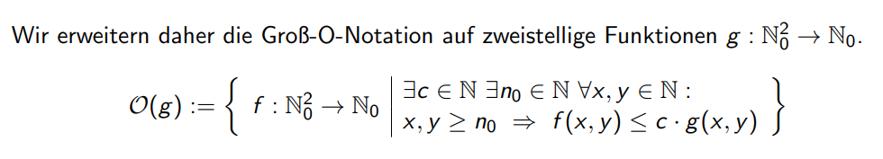
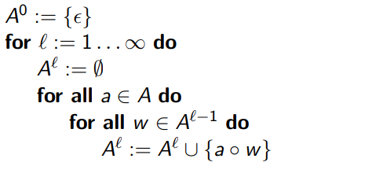
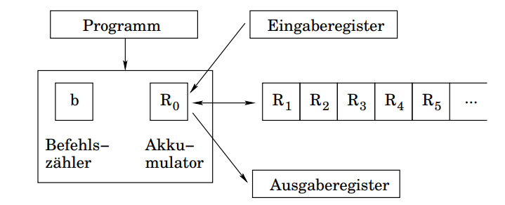
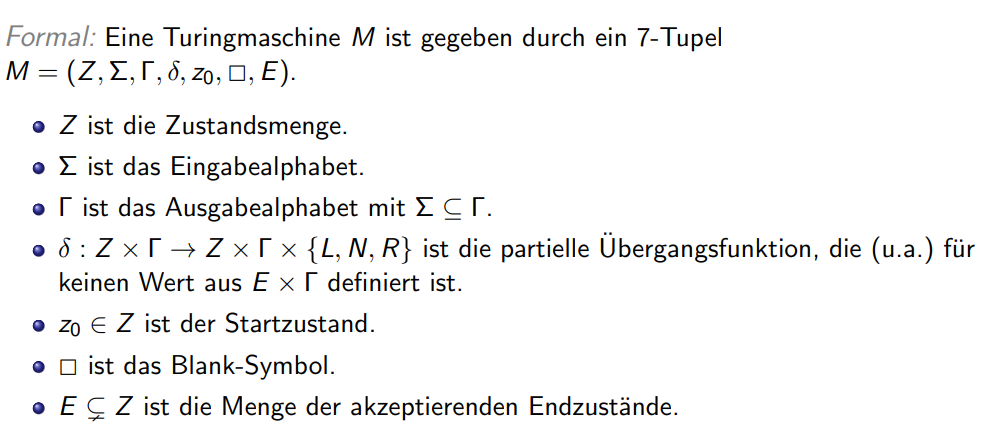
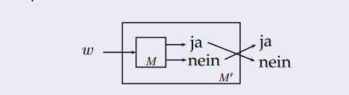
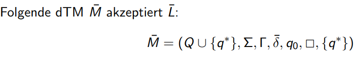

# EAL

1. Bewertung von Algorithmen
2. Berechenbarkeitstheorie
3. Komplexitätstheorie
4. Exakte Algorithmen für schwere Probleme

## Heap 
- Array den man sich als Binären Baum vorstellt
- schlechte Datenstruktur -> viele Cache Misses
- Binäre Suche auch schlecht bzgl. Cache Effizienz
- B-Bäume sind externe effiziente Datenstrukturen(werden in Datenbanken verwendet).

## Bewertung von Algorithmen
- Unterschiedliche Hardware ist unterschiedlich schnell und der selbe Algorithmus kann auf verschiedenen Systemen unterschiedlich gut laufen -> bewertung in Komplexitätsklassen

### Kriterien
- Korrektheit: 
- Laufzeit: 
- Speicherplatz:
- Kommunikationszeit: Wie schnell werden Informationen ausgetauscht
- Güte: Was ist die bestmögliche Lösung?

Je mehr Speicherplatz vorhanden ist, desto schneller kann ein Algorithmus laufen

Sortieren und die nebenliegenden Zahlen betrachten
-> $O(nlog (n)+n) = O(nlog(n))$ Sortieren und einmal durchlaufen

### Quadratische Laufzeit
$n -> n^2 = x \ sec$
$2n -> n^2 = 4n^2 = 4x \ sec$
- Doppelte Anzahl an Elementen -> 4mal so lange Laufzeit

### Groß $O$
- Einteilen in verschiedene Komplexitätsklasssen $O(1), O(n), O(2^n)$
- heißt nicht automatisch worst case, kann auch average und best case sein
- Es können Zeit und Platzkomplexität beschrieben werden(in abhängigkeit der Eingabelänge)
- Menge an Funktionen die Asymptotisch höchstens so stark wachsen wie $g$
- $O(g) = \{f|\exists c \in \mathbb{N} \exists n0 \in \mathbb{N} \forall n \geq n0 : 0 \leq f(n) \leq c g(n)\}$

- $f = \mathbb{N_0} \rightarrow\mathbb{N_0}$ so definiert, man zählt Anzahl an schritten und gibt Anzahl an Elementen an
- wichiig Konstante Faktoren werden ignoriert
- Kann auch über Grenzwert angegeben werden
- $lim_{n \rightarrow \infty}\frac{f(n)}{g(n)} <= c$
- Es interessiert nur das Asymptotische Verhalten im unendlichen (das gleiche wie ab einer Stelle $n_0$)
- Man sucht immer die kleinste Obere Schranke
- Ebenso Untere Schranken $\Omega(g)$
- $\Omega(g) = \{f|\exists c \in \mathbb{N} \exists n0 \in \mathbb{N} \forall n \geq n0 : 0 \leq c g(n) \leq f(n) \}$
- $\Omega$: wächst mindestens so stark
- $\Theta(g)$ Funktioniert nur durch Konstanten Faktoren (wächst genauso stark wie)
- $\Theta(g) = \{f| f \in O(g) \land f \in \Omega(g)  \}$
- Keine Basen bei Logarithmen, da diese ineinander umrechenbar sind, die Umrechnung packt man dann in die Konstante $c$ rein.
- Konstante Faktoren werden ignoriert
- $log_b(n) = \frac{log_a(n)}{log_a(b)} = \frac{1}{log_a(b)*log_a(n)}$
- $1/log_a(b)$ ist konstanter faktor
### Beispiele:
$37n^3+2n^2 \in O(n^3)$ 
$37 n^3+2n^2 \in \Omega(n^3)$
### Aufwandsschätzungen von mehrstelligen Funktionen
- Abhängigkeit von mehr als einer Variablen
- Bsp. Textsuche nach wort
- Muster der länge $m$ wird über text der Länge n geschoben und stellenweise auf Gleichheit geprüft $O((n-(m-1))*m)$
- Tiefensuche ist abhängig von Knoten und Kanten
- erweitern $g: \mathbb{N_0^2} \rightarrow \mathbb{N_0} $
- $f:\mathbb{N_0}^2$, und $f(x,y), g(x,y)$
- Notation für Tiefensiche wichtig (mehrere Knoten und Kanten)

### Komplexitätsmaße
- Worst, average und best-case
- Best-Case quasi nie berüchsichtigt
- Average-Case häufig nicht sehr leicht zu bestimmen, da Wahrscheinlichkeit der Eingaben wichtig ist (normal, binomial, Poissonverteilung)
- Bei Worst-Case analyse kann man sich sicher sein, dass Algorithmus nach n Schritten fertig ist
- Murphys Law, im Zweifelsfall geht immer alles schief was scheif gehen kann.
- Bei Echtzeitsystemen, bei denen Reaktionszeiten garantiert werden müssen, sich average case ungeeignet (nur worst case)
### Worst-Case Komplexität
- Laufzeit im schlechtesten Fall
- $W_n$: Menge der Zulässigen Eingaben der Länge n
- $A(w)$: Anzahl Schritte von Algorithmus A für Eingabe w
- $T_A(n)=sup\{ A(w) | w \in W_n \}$ ist eine Obere Schranke für die Maximale Anzahl an Schritten, die Algo A benötigt um Eingaben der größe n zu verarbeiten
- supremum ungefähr maximale Anzahl an Schritten Aw um Eingabe zu Verarbeiten

### Average-Case Komplexität
- $W_n$: Menge der Zulässigen Eingaben der Länge n
- $A(w)$: Anzahl Schritte von Algorithmus A für Eingabe w
- $\bar{T}_A(n) = \frac{1}{|W_n|}   \Sigma_{w \in W_n} A_w $
- Average Komplexität ist die Mittlere Anazahl an benötiogten Schritten
- arithmetischer Mittelwert

## Berechenbarkeit
### Vorbemerkungen
- Alphabet $A$: endliche, nicht leere Menge an Zeichen (Symbole oder Buchstaben)
- Wörter: Endliche Folgen $(x_i,...,x_k) mit x_i \in A$: haben die Länge $k$
- Die Menge aller Wörter über dem Alphabet $A$ wird mit $A^*$ bezeichnet
- leere Wort: $\epsilon$
- Die Menge $A^*$ ist abzählbar (man kann die Elemente nummerieren)
- Beispiel: $A = \{ 0 1\}$
- $\epsilon$, 0, 1, 00, 01, 10, 11, 000, etc hänge Zeichen an und Zähle so sukzessiv alle Wörter auf
- 

### Rechnermodelle
- Random Access Machine (RAM, Registermaschine)
- verfügt über eine Raihe an Befehlen (read, write, add, sub, goto, if goto)
- abzählbar unendlich viele Speicherzellen (R0,R1,R2,...)
- Akkumulator (Register für Arithmetik)
- Ein und Ausgabe Register
- Kostenmaße: uniform (Anzahl der Ausgeführten Befehle)
- logarithmisch (binäre länge der benutzten Operanden berücksichtigen)
- RAM ist sehr ähnlich zu echtem Computer im Gegensatz zu einer Turingmaschine
- 
- RAM entspricht auch intuitiv dem Berechenbarkeitsbegriff

### Berechenbarkeitsbegriff
- Ist es Grundsätzlich Berechenbar
- Eine Funktion $f: \mathbb{N^k} \rightarrow \mathbb{N}$ ist berechenbar, wenn falls es ein RAM Programm p gibt (es reicht die Existenz), sodass gilt, p berechnet m zur Eingabe n1,...,nk genau dann wenn f(n1,...,nk) = m
- Ein Programm berechnet eine Ausgabe zu einer gegebenen Eingabe
### Turingmachinen (deterministisch)
Turingmaschinen bestehen aus einem Unendlichen Band auf dem Zeichen gelesen und geschrieben werden können.
Ein Schreib und Lesekopf bewegt sich dabei über das Band
Dabei kann nur das zeichen geändert oder ignoriert werden, auf dem aktuell der Schreib-Lesekopf zeigt.
Das Band ist dabei initial mit dem Blank Symbol initialisiert.

- Zustandsübergänge $\delta(z,a) = (z',b,x)$
- Wenn sich eine Turingmaschine M in Zustand z befindet wird und das Zeichen a unter dem Kopf befindet, dann geht M in nächsten Schritt in den Zustand z' über, überschreibt a mit b, und führt eine Kopfbewegung $x \in \{ L,N,R\}$ aus.
- Turingmaschinen können konfigurationen haben (Momentaufnahme der Turingmaschine)
- $\alpha \beta \in \Gamma^*$ ist der bereits besuchte Teil des Bandes
- Schreib Lesekopf steht auf dem ersten Zeichen von $\beta$
- z ist der aktuelle Zustand der Maschine
- Turing Maschienen können Sprachen akzeptieren oder Verwerfen
- Die von einer Turing maschine akzeptierte Sprache ist folgenderweise definiert:
- $T(M) = \{ x \in \Sigma^* | z_0 x \rightarrowtail \alpha z \beta, \alpha, \beta \in \Gamma^*; z \in E \}$
- Nach Endlich vielen Schritten von einer Startkonfiguration $z_0x$ erreicht die Turingmaschine die konfiguration $\alpha z \beta$
- Ist ein Wort nicht in einer Sprache darf die Turingmaschine in einer Endlosschleife gehen (oder es gibt einen verwerfenden Endzustand).
- Rekursiv aufzählbare Turingmaschine  $L \subseteq \Sigma^*$ Wenn eine dtM die Sprache L akzeptiert
- Falls M die Sprache L akzeptiert und für alle Eingaben $x \in \Sigma^*$ hält, so entscheidet M die Sprache L
- $\Sigma ^*$ = alle Wörter des Eingabealphabetes
- $L \subseteq \Sigma^* $ heißt entscheidbar oder rekurisv, wenn es eine dtm gibt, die L Entscheidet
- Das Entscheiden von Sprachen ist equivalent zum Berechnen von Funktionen

### Rekursiv Aufzählbare Sprachen
- Es gibt eine TM die Anhält, wenn ein Wort w zur Sprache L gehört, sonst aber u.U nicht.

#### Funktionen mit einer Turingmaschine Berechnen
- Berechen $f: \Sigma^* \rightarrow \Sigma^*$
- Es muss für ein $z_e \in E$ gelten:
- $z_0 x \rightarrow z_e y \leftrightarrow f(x) = y$
- Für ein Eingabewort schreibt eine Turing maschine ein Wort auf das Band und geht anschließend in ein Akzeptierenden Endzustand
- Man benutzt immer dtms für Funktionen 
- 
### Rekursive (Entscheidbare) Sprachen
- Entscheidbare Probleme
- Gegenüber Komplement bildung abgeschlossen
- Rekursive Sprachen: Eine Sprache $L$ ist Rekursiv(Entscheidbar) wenn eine Turingmaschine für jedes Wort aus $\Sigma *$hält und für jede Eingabe $w \in \Sigma^*$ dann akzeptiert, wenn das Wort w in der Sprache L ist.
- Eine dTM M entscheidet die Sprache L
- Man Konsturiert dann eine TM M', dass M' nicht akzepitert wenn M in einen Endzustand über geht. Wenn M akzepitert hält geht M' in einen Endzustand über
- 
- 
- Sprachen sind Entscheidbar wenn die Sprache $L$ als auch das Komplement $\bar{L}$ rekursiv aufzählbar sind.
- Verwende 2 Turing-Maschinen die M1 und M2 die $L$ und $\bar{L}$ akzeptieren.
- M führt jeweils 1 Schritt von M1 und M2 aus, und hält falls eine der beiden hält.
- M akzeptiert, wenn M1 akzepitert, sonst wird nicht akzeptiert.

#### Kostenmaße bei Turingmaschinen
Laufzeit: Anzahl der Zustandsübergänge
Speicherplatz: Maximale Länge einer Konfiguration während der Berechnung

#TODO
### Zustände von Turing-Maschinen merken

### Mehrband-Turingmaschinen
- verwenden mehrere Bänder
- weiterhin nur 1 Schreib/Lesekopf
- $\Gamma^k $ statt $\Gamma$
- Jede t(n)-zeit, s(n)-platzbeschränkte k-band Turingmaschine kann durch eine 1 Band dTM in O(t(n)*s(n)) auf platz O(s(n)) simuliert werden.

#### k-Band dTM
- k-Bänder mit je einem Kopf die sich unabhängig voneinander Bewegen können.
- Eingabewort steht immer auf dem ersten Band, alle anderen Bänder sind mit Blanks belegt am Anfang
- $\delta: Q \times \Gamma^k \rightarrow Q \times \Gamma^k \times \{R,N,L \}^k$
- Übergänge stehen für jedes Band da bsp. $(aa/bb/lr)$ (2 Bänder = 2 gelesene Symbole zwei geschriebene Symbole 2 Richtungswechsel)
- können in 1-Band dTMs umgewandelt werden
- Übersichtlicher
- mehrere Stellen des Eingabewortes gleichzeitig bearbeitbar

#TODO Sternmarken fragen

### dTMs und RAMs

# Nicht Berechenbare Probleme
Diagonalsprache ist nicht entscheidbar

# Reduktion
Halteproblem Gegeben ist Programm als Gödelnummer mit einer Eingabe
Halteproblem als Sprache formuliert
Halteproblem ohne Eingabe gleiche wie Halteproblem nur ohne Eingabe 
Wir wissen das Diagonalsprache nicht entscheidbar ist -> andere Sprachen auf diese Sprache abbilden (bzw. auf das Komplement)
Wenn Sprache nicht entscheidbar ist, ist Komplement auch nicht entscheibar

- $L <= L'$ (mittels einer Funktion $f$)

Zeige; $!DIAG <= H$
Baue Turingmachine die auf dem leeren Band hält

## Universelle Turingmachine 
Eingabe ist Programm als Gödelnummer

# Was ist besser?
- Viel Platz oder viel Zeit
- Turingmaschine: N Zeitschritte Nutzen maximal N Felder
- Zeit aus Platz bei Turingmaschine Ableitbar, wegen endlichen Zuständen und endlichem Bandalphabet
- $s(n) = n$
- $t(n) > |Z|x|\gamma|^n$
- Nehme 2. Band und Zähle Schritte. Wenn mehr Schritte als als mögliche Kombinationen -> endlosschleife

## Cliquenproblem
- Gegen Graph G(V,E) und einem $k \in \mathbb{N}$
- In polynomieller Zeit

## Hamiltonkreis 
- auch einfach
  
## Independent-Set
- Kein Knotenpaar ist durch eine Kante verbunden

## Dominating set
- Suche eine Möglichst kleine Knotenmenge

Sehr einfache Probleme, aber sind nicht sehr effizient
Für feste k = polynomielle Laufzeit, allerdings exponentiell wenn k nicht beschränkt ist

Warum wird k mit übergeben?
- Weil sonst kein Zertifikat angegeben werden kann.
- Probleme in NP sind fast allesamt entscheidungsprobleme
- Probleme werden als Sprache formuliert

- Reicht es eine Entscheidungsvariante zu lösen
- DEC = Decision, MAX, SEARCH 
- $DEC \in NP$
- SEARCH -> MAX -> DEC (easy zu lösen) andersrum nicht
- Löse Entscheidungsproblem -> dann Max auch einfach (mithilfe von Binärer Suche)
- MAX -> SEARCH ist Problemspezifisch (bei der Clique einfach)
- Sukzessiv Knoten rausnehmen, guck ob sich größe der Clique dadurch ändert (wenn nicht, dann Knoten unwichtig, sonst Knoten gehört zur Clique)

# K-Färbung
- Jeder miteinander Verbunde Knoten muss eine andere Farbe haben
- MIN -> SEARCH ist Graph mit k-Farben Färbber, erzeuge weitere k-Clique
- Weise dem Graph Farben mit k-Clique zu (jeder Knoten in Clique hat Farbe $f(x_i) = i$)
- Füge dann neue Kanten hinzu zwischen Knoten und Clique
- Färbungen werden anhand Fehlender Kanten abgelesen
- Finde so ein Graph löst das Suchproblem

Wir machen nur Entscheidungsprobleme, weil die einfach sind und man diese sowieso auf die anderen Problme Reduzierbar sind

HCP = Hamiltion-Circuit-Problem

# Reduktion bei der Komplexitätstheorie
wie bei Berechenbarkeit
- Unterschied Funktion f muss nicht nur Berechenbar sein, sondern zusätzlich in Polynomieller Zeit Berechenbar
- Reduktion ist Transitiv $L_1 \leq L_2 und L_2 \leq L_3 = L_1 \leq L_3$

## Die Klasse NP
$P \in NP$
P ist in NP (man weiß aber nicht ob die gleich sind)
Daneben sind schwere Probleme in NP definiert (Dies sind die NP-vollständigen Probleme)
$L \in NP$
- alle $L' \in NP$ sind Polynomiell reduzierbar auf $L$

# SAT (Satisfiability) Erfüllbarkeitsproblem
- Erstes NP-vollständiges Problem
- Reduktionen von dieses Sat Problem
- Man baut Schaltkreis
- $SAT = {F | F ist eine erfüllbare aussagenlogische Formel}$
- Wenn alle Probleme nicht sc
- Mit Zertifkiaten (dann steht da NP)
- nicht deterministisch (mit nicht deterministischer Turingmaschine)

Formel:
- Reduktion muss in Polynomieller Zeit erzeugt werden.
- Teilformel $G$: von k vielen Variablen 
- sorgt dafür, dass genau eine einzige Variable auf 1 gesetzt ist

- U2 drückt auch aus, was sich nicht ändert
- Da wo nichts geändert wird bleibt das Zeichen gleich

# Wie zeigt man:
- man hat nur Polynomielle Anzahl an Variablen
- $x \in L <=> F(x)$ (x in Sprache L)
- F(x) ist berechnungsformel für Turingmaschine
- Man muss prüfen, wie lange die Teilformeln sind
- Man muss auch Anfangsbedingung 
- Sind andere Formeln leichter zu lösen?
- KNF und DNF sind villeicht leichter zu lösen aber Umwandlen hat exponentiellen 
- SAT ist NP-vollständig, Reduziere andere Formen auf das SAT Problem $SAT \leq_p 3KNF-SAT$
- SAT Formeln als Baumstruktur

## Hinweis Implikation
Hinweis: Aus was falschem kann man alles folgen deshalb 0 -> 1  = 1 !x 
ABER: aus etwas wahrem kann man nichts falsches folgern
Tiefensuche findet Graphen in Kreis (wenn Rückwärstkante existiert)

Formel als Baum darstellen

## 3KNF-SAT
Name weil 3 Literale in Term

## 2KNF-SAT
$\in P$

- Spezialfall von KNF SAT
## KNF-SAT 
- Auch Np-vollständig

## DNF SAT
- In P
- Easy nur eine Klausel muss erfüllt sein
- Klausel erfüllbar, wenn Variablen alle unterschiedlich sind
- Aber Umwandeln unter Umständen in exponentieller Zeit

Die Untersuchung ob ein Problem schwer ist, muss für jedes Problem einzeln gestellt werden
Spezialfälle 
Zertifikat

## 3KNF-SAT $\leq_p Clique$
-(x v y) = (x v x v y)

## Hornklauseln 
- $\in P$ mithilfe von Markierungsalgorithmus
  
- Aussagenlogische Formlen müssen in Graphen umgewandelt werden
- 

## Hamiltonkreis
- Jeder Knoten muss einmal besucht werden
- ist Np vollständig
- Klauselgraph bilden
- Der Graph ist so aufgebaut, dass jeder Knoten besuht werden
- Ist erfüllende Belegnung, wenn Ausgang oberer Knoten ist

## Eulerkreisproblem
- einfahc zu lösen, gucken ob Knotengrad gerade ist
- Wenn es ein Eulerkreis gibt, suche Kreis mit Tiefensuche, entferne diesen aus dem Graph und suche in jeder Zusammenhangskomponente einen Euler kreis

## Knotenfärbung
- Schreibe Zahlen an die Knoten 
- Reduktion von 3KNF-Sat ist einfach 
- Beginne mit 3 Clique
- FÜhre für jede Variable 2 Knoten ein (je ein KNoten für positive und Negative Komponente)
- 

## 2-Färbbar wie kann man das zeigen?
- Einfache Datenstruktur
- Jede gerde ebene kriegt Farbe 1, jede ungerade ebene bekommt Farbe 2
- Hat ein Graph eine ungerade Anzahl an Knoten
- Bei Kreisen mit ungeraden Knoten
- Tiefensuche machen
- Bei der Tiefensuche kann man Färbung direkt dranschreiben

## 
Basisänderungen bei exponentiellen Laufzeiten, machen viel aus

## Algorithmen Independent set
Independent Set bei Kreisen leicht zu finden
Man fängt mit einem einfachen Algorithmus an
Man nimmt irgendein Knoten und schaut sich den Worst Case an
Anschließend weiter verbessern

# Entwurfsmethoden 
- Greedy Algorithmen
- dynamische Programmierung
- Greedy
- local Search

## Divide and Conquer
Problem wird in Teilprobleme aufgeteilt, welche dann rekursiv gelöst werden

## Laufzeit Rekursionsgleichungen
Vorne stehen zweierpotenzen wegen *2
Leite aus dem eingesetzen eine Formel ab
Falls Wurzel oder log da steht -> Variablensubstitution

## Strassen Algorithmus
Effiziente Matrix Multiplikation
weniger Multiplikationen dafür mehr Additionen

Charakteristische Operationen:
- Addition und Multiplikation

## Untere Schranke der Matrixmultiplikation: $O(n^2)$

## Algorithmus von Karazuba (Matrixmultiplikation)
- Zerlege Ziffern in Obere und Untere Bereiche

## Master Thereom
- $T(n) = a (T(n/b) + \Theta(n^k))$ a = Anzahl rekursive Aufrufe

# Dynamische Programmierung
Berechnung von Fibbonacci Zahlen
Lösungen werden zwischengespeichert werden
Das Speichern nennt man Memorieren (Top-Down-Ansatz)
Immer noch Rekursiv aber mit zusätzlichem Array zum Speichern von zwischenergebnissen

Folie 244: gestrichelte Linien sind Arrayzugriffe

Bottom-Up: Iterativer Ansatz, verwende for schleifen und Arrays zum Speichern
-> Bessere Laufzeit
Dynamische Programmierung, verwendet man bei Optimierungsproblemen

Beispiel ist die Matrix-Ketten Multiplikation
Finde beste Reihenfolge an Matrixmultiplikationen, dass Operationen minimal werden
Wieviele Klammerungen gibt es
Probiere alle Kombinationen durch

Rekursionsende i = j

## 0-1 Rucksackproblem (Dynamische Programmierung)
Jedes Objekt hat eine Größe, Wert, Gewicht
Maximiere den Wert, ohne ein Gewicht zu überschreiten
Das 0/1 Rucksackproblem ist Schwach NP-Vollständig
Der dynamische Algorithmus ist ein pseudo polynomieller Algorithmus
G ist ein numerischer Wert der binär kodiert wird
Eingabelänge ist $log_2(G)$
$O(n G) = O(n 2^{log_2(G)}) = O(n2^{|G|})$

## Schwach-Np-vollständig
treten nur bei Numerischen auf
Effiziente Alogorithmen nur wenn Numerische Werte nicht zu groß werden

## Polygon Triangulierung
Trinagliere so, dass Umfang der Dreiecke möglichst klein sind

## Levenshtein Distanz
WIeviele Schritte sind Nötig, um ein Wort in ein anderes Wort zu überführen

## CYK Algorithmus
Prüft ob ein Wort zu einer Sprache gehört

## Dynamische Programmierung Traveling Salesman
Das Optimalitätsprinzip gilt nicht -> Dann keine reukrsionsgleichung
Es gibt Trick. ersten Knoten rausnehmen -> Dadurch keine Kreise sondern kürzesete Wege 
In jedem Schritt wird ein Schritt rausgenommen,mächtigkeit $2^n$
größe Tablle $n 2^n$

## Greedy Algorithmen
Optimal Merge Patterns
2 Datein Mergen Laufzeit = $O(q1+q2)$ q1,q2 Länge von Array 1,2
Man will Reihenfolge ermitteln für optimalen Merge
Merge nach größen
Ähnlich zu Matrix-Ketten-Multiplikation

### Warum interessiert die Korrektheit bei Greedy und nicht bei dynmaischer Programmierung?
Weil bei Dynamischer Programmierung alle möglicheiten Durchprobiert worden sind.
Bei Greedy-Algorithmus wird nur eine Möglichkeit überprüft -> deshalb muss Korrektheit mit vollständiger Indution gezeigt werden.

Greedy Algorithmen sind sehr einfach

## Fractional Knapsack
Objekte können auch halb reinkommen
Alpha ist Faktor wie sich Wert für 1 ändert

## Coin Changing Problem
Geld wechseln
möglichst wenig Münzen benutzen
wie oft passt die größte Münze in das Wechselgeld
Greedy funktioniert nur bei bestimmten Zahlensystemen
Man muss scih überlegen pb ein anderer Algorithmus eine bessere Lösung produziert
es gibt eine optimale Suchstruktur -> dynamische Programmierung 
Alle möglichkeiten durchprobieren
Das Problem ist Schwach-NP-vollständig 

## Präfix-Code
Kein Codewort ist Anfangswort von einem anderen
Greedy nach Wahrscheinlichkeiten

Zu jedem Greedy Algorithmus muss gezeigt werden, dass die Wahl korrekt ist, dass muss man bei der dynamischen Programmierung nicht.

# Lokale Suche
Man beginnt bei einer beliebigen Lösung und modifiziert diese
Wenn neue Lösung besser ist, übernehme die neue Lösung

## Beim Travelling salesman
Wähle zwei zufällige Knoten die nicht aufeinanderfolgend sind
lokal nur, wenn Matrix symmetrisch ist, Weil zurückgehen nicht teuer wird

## Permutationen
jeweils immer 2 Zahlen tauschen, und Ret des Arrays Rekursiv genauso machen

## Graph Partitionierung
Unterteile Graoh so, dass Kanten zwischen den Mengen minimale Kantengewichte haben

# Sortieren
## Quicksort
- Divide and conquer
- nehme Pivot-Element und sortiere linken und rechten Teil rekursiv
- Welche Laufzeit hat Quicksort, wenn die Aufteilung immer in einem festen Verhältnis erfolgt?
- Benutze Rekursionsbäume für die Herleitung
- Setze rekursiv ein Daraus ergibt sich das Pascalsche Dreieck mit den Binomialkoeffizienten
- Auf einer Ebene
- $T(1) = k => k \in O(1)$ tritt auf,wenn $(\frac{9}{10})^k n = 1$ ist
- Es gibt ein Aufteilungsaufwand $cn$
- Summen wegmachen, indem man mit andere Summe subtrahiert
- Worst case tritt in stark vorsortierten folgen auf
- Verwende Zufallsstrategie  
- In der Praxis ist quicksort nicht toll :(
- Laufzeit bei eingeschränktem Wertebereich (ca. Quadratische Laufzeit (Worst-Case tritt ein))
- Viele Zahlen aus kleinem Wertebereich führen zu Worst Case, da viele Zahlen doppelt vorkommen
- Viele doppelte Zahlen
- Quicksort kann man besser machen. indem man 3-Wege Split Quicksort macht
- In Standard lib ist kein 3 wege split implementiert
- Rekursionstiefe ein Problem

## Heap-sort
- Heap ist ein Array als Binärbaum vorgestellt
- Heap erfüllt die Heap-bedingung (Nachfolger kleiner als vorgänger  (bei maxheap) bei minheap andersrum)
- Ablauf: Zahlen Tauschen -> Versickern(wegen verletzter heap bedingung) -> Tauschen -> versickern etc
- höchstens n-1 viele Vertauschungen -> Versickern (log n), weil Binärbaum Tiefe log n hat.
- Initialer Schritt heap erstellen
- Heap erstellen dauert n log n, weil nur versickerungsschritte
- Auch in linearer Zeit möglich

### Warum nimmt man kein Heap-sort
- Man hat große Sprünge im Speicher -> Viele Cache Misses
- Cache misses -> ca. 50-fache Zugriffszeit, deshalb ist mittlere Laufzeit schlechter als Quicksort
- Quicksort besseres Cache Verhalten

### Merge-sort
Benötigt linear viel Speicher und wird deshalb nicht so gerne verwendet

## Wie zeigt man die Untere Schranke
mithilfe von Entscheidungsbäumen
Stelle entscheidungsbaum auf, um Laufzeit des Algorithmuses zu ermitteln
Laufzeit ist Wurzel bis Blatt für eine Konkrete Situation
- Worst case laufzeit ist maximale Tiefe
- Mittlere Blattanzahl ist average Laufzeit
- es gibt n! viele Blätter (Permutationen)
- Beweis erfolgt mithilfe der Stirling Formel und logartimus regeln
- Average Laufzeit erfolgt mithilfe von Widerspruch

## Sortieren mit SChlüsselvergleichen geht nicht besser als O(nlog n)
- Bessere Verfahren sind Counting Sort, Radix-Sort, Bucket-Sort

### Counting sort
- Fester Wertebereich. Zähle wie oft Array gefunden wird.s
- benutze Count Array in größe des Wertebereiches
- Bilde Summen auf dem Count array -> Anschließend kann man ablesen welche Zahl an welche Stelle geschirebn werden kann.

### Radix-sort 
funktioniert nur für integer werte, niht für double werte, für strings auch nicht, deshalb nicht in standardbib verwndet

### Starke zusammenhangskomponente
maximal: Es darf kein Knoten hinzugenommen werden und es bleibt weiterhin eine Starke zusammenhangskomponente
- müssen maximal sein
- schwach zusammenhängend,wenn man Kantenrichtungen ignoriert
- laufzeit O(V+E)
- Tiefensuche zum rausfinden ob Graph zusammenhängend ist

## Anmerkung
Keine Querkanten, forwärtskanten bei ungerichteten Graphen
- Aus Querkanten würden Baumkanten werden
- Man muss gucken ob es Rückwärtskanten gibt, die höher als eine Schnitttkanten läuft
- Teilgraphen können nur über queerkanten verbunden werden
- wichtig ist wie weit Rückwärtskanten zurückgehen (das ist der low Wert)

## Spannbäume
Ein Spannbaum Teilgraph eines ungerichteten Graphen, mit der gleichen Knotenmenge mit genau V-1 vielen Kanten und zusammenhängend ist
- man benötigt Kostenfunktion

## Baum ist ein zusammenhängender azyklischer Graph
- muss Kreisfrei sein

## Kruskals Algorithmus
- Union und findSet Operationen

## Übung
- h=0
- $h^2=1$
- höhe ändert sich nur wenn Bäume den gleichen Rang haben
- $2^h+21h=2*2^h=2*2^{h+1}$
- E <= V^2

## Warum ist es nicht günstiger alle Knoten unter die Wurzel zu hängen
- Beschleunigung durch Pfadkomprimierung
- Vorgänger speichern
- Ziel ist das Verringern der Baumhöhe

## Union Find algorithmus
- Apspeichern von Mengen, macht Union und Find Operationen schnell
A = {2,3,5,7,11}
B = {3,5,7,9,13}
Laufzeit = Summe der Beiden Längen

## Prim Algorithmus:
- Laufzeit je nach implementiertem ALgorithmus
- Binärheap bei vielen Kanten teilweise schlechter

## Kürzeste Wege
Für kürzeste Wege gilt die Dreiecksungleichung

### Dijkstra Algorithmus
- S hat nichts mit dem Algorithmus zu tun, nur für Beweis notwendig
- Dijkstra zu modifizieren, ändert Laufzeit, eventuell läuft man in endlosschleifens
- Keine Negativen Kantengewichte
- verwende stattbesseden Bellman/Ford

## Bellman/Ford
- negative Kantengewichte
- Beschleunigung bei azyklischen Grpahen. Topologische Sortierung (Tiefensuche)

## Floyd Warshall
Bei einem kürzesten Weg sind auch alle Teilwege kürzeste Wege (Optimalitätsprinzip)
Laufzeit $V^3$
- Warum verwendet man 2Dimensionales Array bei 3 Parametern?
- Kreis negativer länge erkennen: Diagonale angucken

## Transitiver Abschluss (Warshall)
welche Knoten stehen in Beziehung zueinander
- 1->2->3->4->5
- 1->3, 3->5, 2->4, etc

# Netzwerke
- Flüsse
- Wieviel Strom kann fließen,
- Wasser in der Kanalisation
- Verkehrsflüsse
- Kosten werden Kapazitäten, wieviel Wasser passt z.B. durch ein Rohr
- Kapazität beschränkt
- Fluss muss erhalten bleiben, kann nicht einfach verloren gehen
- Fluss definiert als Kapazität die Einflisst - Kapazitäz die rausfließt
- Quelle in Menge S und Senke in Komplementmenge
- Wert des Flusses will man an jeden beliebigen Schnitt ablesen
- Beweis über Induktion
- Fluss ist immer so groß wie die Kapazität

## Pfad 
- kann Rückwärtskanten erhalten

## Flussalgorithmen
- beginnen bei beliebiger Flussfunktion f(e)
- Fluss der über Kante nicht brauch toleranz (nicht max kapazität)
- man muss zeigen dass der Fluss vergrößert wurde und das die Kapazität nicht überschritten wird
- weil delta e kleinster Wert ist

## Wie findet man Pfad
- Tiefensuche funktioniert nicht
- Restgraph erstellen
- Rückwärtskanten immer wenn wert nicht 0 null (Wert muss man vermindern können)
- Falsche Entscheidungen Beim Graphen führen zu nicht maximalen Graphen (Die muss korrigert werden, mithilfe von Rückwärtskanten), Tiefensuche über Rückwärtskanten

## Max-Flow Min Cut
### TODO

## Netzwerkfluss nach Edmonds Karp
- Schichtengraph = Restgraph wo Kanten gestrichen worden sind
- Laufzeit: $O(E^2*V) <= O(V^5)$
- nicht nutzbar praktisch

## Dinic
- Baue Schichtengraph auf
- finde einen Blockiredenfluss und berechene neue Flussfunktion
- baue danach wieder Restgraph
- $O(E^2*V)$

# Klausur
- Was ist ein Fluss, Flussfunktion, Restgraph, Schichtengraph, Flusserhaltung, warum Rückwärtskanten

## Push Relabel Algorithmus
- Gegeben NEtzwerk mit Kapazitätsfunktion
- Flusserhaltung wird vernachlässigt -> PRäfluss wird definiert
- Ein Knoten hat überschuss, dann heißt der aktive(active)
- Knoten werden höhen zu geordnet (Wasser kann nur von höher zu niedriger fließen)
- Kante von u -> v Kante muss Kapazität über 0 sein
- Relabel Funktion hebt einen Knoten an(macht höhe größer)
- Es muss ein Weg existieren von Knoten mit Überschuss zu Quelle s
- s muss in der Menge aller erreichbaren Knoten liegen
- Für eine Kante muss muss gelten dass kein fluss drüber fliegt
- Laufzeit, maximale höhe 2V-1 -> $V^2$ viele Relabel Operationen(maximal)
- sättigende und nicht sättigende Push Operationen (beziieht sich auf Kante)
- sättigend wenn Kante nach Push Operation die Maximale Kapazität erreicht hat
- u muss jedes mal um mindest 2 größer sein als vorher
- $V*E$ sättigende Push Operationen (maximal)
- Potential funktionenen für die Abschätzung von nicht sättigenden Push Operationen
- Präzisierung des Algorithmuses führt zu $O(V^3)$
- Wird schneller, da kein Fluss aufrecht erhalten werden muss, sondern ein Präfluss verwendet wird
  
- Edmond-Karp: $O(V E^2) = O(V^5)$
- Dinic; $O(V^2 E) = O(V^4)$
- Push Relabel: $O(V^3)$

# Matching Probleme
## Matching
- Größtes Matching hat V/2 Kanten

### Maximum weight Matching
- Summe der Kanten des Matchings

### Matching ikn bipartiten Graphen
- Baue aus bipartitem Graph ein Netzwerk und wende Flussalgorithmen darauf an
- Aus zunehmenden Wegen werden Alternierende Wege
- Abwechselnd freie und Gebundee Kanten
- Weg muss mit freiem KNoten beginnen und Enden
- Wenn sowas existiert, kann Matching vergrößert werden
- Verwende Breitensuche um zunehmend alternierende Wege zu finden
- Algorithmus von Hopcroft und Karp (verbesserter Algorithmus)

### Kann man so ein Matching auf Algemeine Graphen anwenden?
- Problem: Bei der Breitensuche kann Fehler passieren
- Problem besuchte Knoten werden nur 1mal verwendet (Ist aber notwendig)
- Parität: Knotenlänge gerade oder ungerade
- Kreise mit ungeraden Längen sind Probleme (Blüten)
- Schrumpfe Blüte auf 1 Knoten zusammen (am Ende wieder rückgängig machen)

## Spezielle Graphklassen
- Bei n clique mindestens 4 Farben zum Einfärben
- Graphklassen die die Probleme effizient lösen

### Grapheigenscahft
- Menge von Graphen
- Monoton (Jeder Teilgraph eines Baumes ist ein Baum)
- hereditär (Jeder Induzierte Teilgraph ist ein Baum)

### Baum
- weder Monoton noch hereditär
  
### Wälder 
- Menge von Bäumen
- nicht zusammenhängender Kreisfreier Graph
- Monoton und hereditär
- Kanten entfernen erzeugt keine Kreise

### Bipartit
- Monoton und hereditär
- Gleiche Begründung wie Wald

### Co-Graphen 
- name kommt von komplement Graphen (veraltet)
- Disjunkte Summe, müssen Disjunkte Graphen sein
- Das Erstellen von Co-Graphen lässt sich als Baum darstellen
- 
  
  

### Frage Ist ein Baum/Wald Monoton/Hereditär

### Co-Graph 
- darf kein P4 enthalten weil Komplement von P4 = P4 ist
- Wenn man Co-Baum hat, ist independent set,Färbung,Clique, etc effizient in O(V+E) zu lösen
- Erkennungsalgorithmen, liefern Anhaltspunkt für die Lösung

## Planare Graphen
Planare Graphen, kann man so in eine Ebene Zeichnen, dass sich keine Kanten außer in den Knoten kreuzen
### Eulersche Polyeder Formel
Anzahl der Knoten - Anzhal der Kanten + außerere Flächen (f for faces) = 2 
einfache Graphen = Keine Parallelen Kanten
Baum ist planar
Wenn man Kanten aus Kreis entfernt, verschwinden Flächen
E und F wird kleiner (deshalb gilt Beziehung)
- Eine Kanten kann maximal 2 Flächen Begrenzen
- Jede Fläche ist durch mindestens 3 Kanten begrenzt
- PLanare Graphen sind dünne Graphen
- Der vollständige Graph mit 5 Knoten ist kein planarer Graph
- Jeder Knoten ist mit 4 anderen Knoten verbunden
- Bei Bipartiten planaren Graphen gibt es keine Kreise der Länge 3 gibt, deshalb gibt es 4 Kanten die Flächen begrenzen

### Ist jeder (induzierte Teilgraph) eines planaren Graphen planar?
- Eigenschaft ist Monoton
- wegnehmen von Kanten und Knoten nicht dazu, dass sich keine Kanten kreuzen
- Blüten bei dem Matching
- Unterteilungsgraphen -> Kante in Graph wird durch weg ersetzt (neue Knoten nehmen)

### Ist der Peterson Graph planar
- V=5 E=10 f=12
- man kann Kanten kontrahieren, dass K5 oder K3,3 Dabei rauskommt

- Jeder Planare Graph ist 6 und 5 Färbbar
-3Färbung für planare Graphen ist NP-vollständig

### Planare Graphen
- nicht besonders spannend
- nur wegen Fehler in Beweis berühmt
Es gibt haufenweise Graphklassen die alle mehr oder weniger Relevant sind (Intervalgraphen)
- Außen-planar
- Knoten auf Kreis zeichnen, Kanten liegen innerhalb

# Vorrangwarteschlangen
Wie implementiert man die Algorithmen vernünftig?
- Man hat Operationen wie Extract min und Decreasekey
- Verbinde Liste mit Binärheap, sodass sich bessere Laufzeiten ergeben
- Laufzeit ist nur O(Log n) O(n) ist falsch
- 