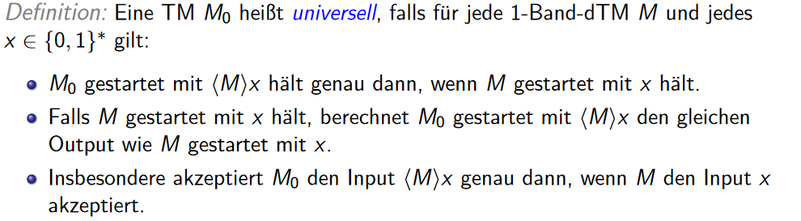

# EAL

1. Bewertung von Algorithmen
2. Berechenbarkeitstheorie
3. Komplexitätstheorie
4. Exakte Algorithmen für schwere Probleme

## Heap 
- Array den man sich als Binären Baum vorstellt
- schlechte Datenstruktur -> viele Cache Misses
- Binäre Suche auch schlecht bzgl. Cache Effizienz
- B-Bäume sind externe effiziente Datenstrukturen(werden in Datenbanken verwendet).

## Bewertung von Algorithmen
- Unterschiedliche Hardware ist unterschiedlich schnell und der selbe Algorithmus kann auf verschiedenen Systemen unterschiedlich gut laufen -> bewertung in Komplexitätsklassen

### Kriterien
- Korrektheit: 
- Laufzeit: 
- Speicherplatz:
- Kommunikationszeit: Wie schnell werden Informationen ausgetauscht
- Güte: Was ist die bestmögliche Lösung?

Je mehr Speicherplatz vorhanden ist, desto schneller kann ein Algorithmus laufen

Sortieren und die nebenliegenden Zahlen betrachten
-> $O(nlog (n)+n) = O(nlog(n))$ Sortieren und einmal durchlaufen

### Quadratische Laufzeit
$n -> n^2 = x \ sec$
$2n -> n^2 = 4n^2 = 4x \ sec$
- Doppelte Anzahl an Elementen -> 4mal so lange Laufzeit

### Groß $O$
- Einteilen in verschiedene Komplexitätsklasssen $O(1), O(n), O(2^n)$
- heißt nicht automatisch worst case, kann auch average und best case sein
- Es können Zeit und Platzkomplexität beschrieben werden(in abhängigkeit der Eingabelänge)
- Menge an Funktionen die Asymptotisch höchstens so stark wachsen wie $g$
- $O(g) = \{f|\exists c \in \mathbb{N} \exists n0 \in \mathbb{N} \forall n \geq n0 : 0 \leq f(n) \leq c g(n)\}$

- $f = \mathbb{N_0} \rightarrow\mathbb{N_0}$ so definiert, man zählt Anzahl an schritten und gibt Anzahl an Elementen an
- wichiig Konstante Faktoren werden ignoriert
- Kann auch über Grenzwert angegeben werden
- $lim_{n \rightarrow \infty}\frac{f(n)}{g(n)} <= c$
- Es interessiert nur das Asymptotische Verhalten im unendlichen (das gleiche wie ab einer Stelle $n_0$)
- Man sucht immer die kleinste Obere Schranke
- Ebenso Untere Schranken $\Omega(g)$
- $\Omega(g) = \{f|\exists c \in \mathbb{N} \exists n0 \in \mathbb{N} \forall n \geq n0 : 0 \leq c g(n) \leq f(n) \}$
- $\Omega$: wächst mindestens so stark
- $\Theta(g)$ Funktioniert nur durch Konstanten Faktoren (wächst genauso stark wie)
- $\Theta(g) = \{f| f \in O(g) \land f \in \Omega(g)  \}$
- Keine Basen bei Logarithmen, da diese ineinander umrechenbar sind, die Umrechnung packt man dann in die Konstante $c$ rein.
- Konstante Faktoren werden ignoriert
- $log_b(n) = \frac{log_a(n)}{log_a(b)} = \frac{1}{log_a(b)*log_a(n)}$
- $1/log_a(b)$ ist konstanter faktor
### Beispiele:
$37n^3+2n^2 \in O(n^3)$ 
$37 n^3+2n^2 \in \Omega(n^3)$
### Aufwandsschätzungen von mehrstelligen Funktionen
- Abhängigkeit von mehr als einer Variablen
- Bsp. Textsuche nach wort
- Muster der länge $m$ wird über text der Länge n geschoben und stellenweise auf Gleichheit geprüft $O((n-(m-1))*m)$
- Tiefensuche ist abhängig von Knoten und Kanten
- erweitern $g: \mathbb{N_0^2} \rightarrow \mathbb{N_0} $
- $f:\mathbb{N_0}^2$, und $f(x,y), g(x,y)$
- Notation für Tiefensiche wichtig (mehrere Knoten und Kanten)

### Komplexitätsmaße
- Worst, average und best-case
- Best-Case quasi nie berüchsichtigt
- Average-Case häufig nicht sehr leicht zu bestimmen, da Wahrscheinlichkeit der Eingaben wichtig ist (normal, binomial, Poissonverteilung)
- Bei Worst-Case analyse kann man sich sicher sein, dass Algorithmus nach n Schritten fertig ist
- Murphys Law, im Zweifelsfall geht immer alles schief was scheif gehen kann.
- Bei Echtzeitsystemen, bei denen Reaktionszeiten garantiert werden müssen, sich average case ungeeignet (nur worst case)
### Worst-Case Komplexität
- Laufzeit im schlechtesten Fall
- $W_n$: Menge der Zulässigen Eingaben der Länge n
- $A(w)$: Anzahl Schritte von Algorithmus A für Eingabe w
- $T_A(n)=sup\{ A(w) | w \in W_n \}$ ist eine Obere Schranke für die Maximale Anzahl an Schritten, die Algo A benötigt um Eingaben der größe n zu verarbeiten
- supremum ungefähr maximale Anzahl an Schritten Aw um Eingabe zu Verarbeiten

### Average-Case Komplexität
- $W_n$: Menge der Zulässigen Eingaben der Länge n
- $A(w)$: Anzahl Schritte von Algorithmus A für Eingabe w
- $\bar{T}_A(n) = \frac{1}{|W_n|}   \Sigma_{w \in W_n} A_w $
- Average Komplexität ist die Mittlere Anazahl an benötiogten Schritten
- arithmetischer Mittelwert

## Berechenbarkeit
### Vorbemerkungen
- Alphabet $A$: endliche, nicht leere Menge an Zeichen (Symbole oder Buchstaben)
- Wörter: Endliche Folgen $(x_i,...,x_k) mit x_i \in A$: haben die Länge $k$
- Die Menge aller Wörter über dem Alphabet $A$ wird mit $A^*$ bezeichnet
- leere Wort: $\epsilon$
- Die Menge $A^*$ ist abzählbar (man kann die Elemente nummerieren)
- Beispiel: $A = \{ 0 1\}$
- $\epsilon$, 0, 1, 00, 01, 10, 11, 000, etc hänge Zeichen an und Zähle so sukzessiv alle Wörter auf
- 
- Eine Sprache und Ihr Komplement können eine von 3 Eigenschaften haben.
- beide sind Rekurisv (und damit auch Rekursiv Aufzählbar)
- beide sind nicht rekursiv aufzählbar
- Eine von beiden ist rekursiv aufzählbar und die andere nicht
- 
- 
### Rechnermodelle
- Random Access Machine (RAM, Registermaschine)
- verfügt über eine Raihe an Befehlen (read, write, add, sub, goto, if goto)
- abzählbar unendlich viele Speicherzellen (R0,R1,R2,...)
- Akkumulator (Register für Arithmetik)
- Ein und Ausgabe Register
- Kostenmaße: uniform (Anzahl der Ausgeführten Befehle)
- logarithmisch (binäre länge der benutzten Operanden berücksichtigen)
- RAM ist sehr ähnlich zu echtem Computer im Gegensatz zu einer Turingmaschine
- 
- RAM entspricht auch intuitiv dem Berechenbarkeitsbegriff

### Berechenbarkeitsbegriff
- Ist es Grundsätzlich Berechenbar
- Eine Funktion $f: \mathbb{N^k} \rightarrow \mathbb{N}$ ist berechenbar, wenn falls es ein RAM Programm p gibt (es reicht die Existenz), sodass gilt, p berechnet m zur Eingabe n1,...,nk genau dann wenn f(n1,...,nk) = m
- Ein Programm berechnet eine Ausgabe zu einer gegebenen Eingabe
### Turingmachinen (deterministisch)
Turingmaschinen bestehen aus einem Unendlichen Band auf dem Zeichen gelesen und geschrieben werden können.
Ein Schreib und Lesekopf bewegt sich dabei über das Band
Dabei kann nur das zeichen geändert oder ignoriert werden, auf dem aktuell der Schreib-Lesekopf zeigt.
Das Band ist dabei initial mit dem Blank Symbol initialisiert.

- Zustandsübergänge $\delta(z,a) = (z',b,x)$
- Wenn sich eine Turingmaschine M in Zustand z befindet wird und das Zeichen a unter dem Kopf befindet, dann geht M in nächsten Schritt in den Zustand z' über, überschreibt a mit b, und führt eine Kopfbewegung $x \in \{ L,N,R\}$ aus.
- Turingmaschinen können konfigurationen haben (Momentaufnahme der Turingmaschine)
- $\alpha \beta \in \Gamma^*$ ist der bereits besuchte Teil des Bandes
- Schreib Lesekopf steht auf dem ersten Zeichen von $\beta$
- z ist der aktuelle Zustand der Maschine
- Turing Maschienen können Sprachen akzeptieren oder Verwerfen
- Die von einer Turing maschine akzeptierte Sprache ist folgenderweise definiert:
- $T(M) = \{ x \in \Sigma^* | z_0 x \rightarrowtail \alpha z \beta, \alpha, \beta \in \Gamma^*; z \in E \}$
- Nach Endlich vielen Schritten von einer Startkonfiguration $z_0x$ erreicht die Turingmaschine die konfiguration $\alpha z \beta$
- Ist ein Wort nicht in einer Sprache darf die Turingmaschine in einer Endlosschleife gehen (oder es gibt einen verwerfenden Endzustand).
- Rekursiv aufzählbare Turingmaschine  $L \subseteq \Sigma^*$ Wenn eine dtM die Sprache L akzeptiert
- Falls M die Sprache L akzeptiert und für alle Eingaben $x \in \Sigma^*$ hält, so entscheidet M die Sprache L
- $\Sigma ^*$ = alle Wörter des Eingabealphabetes
- $L \subseteq \Sigma^* $ heißt entscheidbar oder rekurisv, wenn es eine dtm gibt, die L Entscheidet
- Das Entscheiden von Sprachen ist equivalent zum Berechnen von Funktionen

### Rekursiv Aufzählbare Sprachen
- Es gibt eine TM die Anhält, wenn ein Wort w zur Sprache L gehört, sonst aber u.U nicht.

#### Funktionen mit einer Turingmaschine Berechnen
- Berechen $f: \Sigma^* \rightarrow \Sigma^*$
- Es muss für ein $z_e \in E$ gelten:
- $z_0 x \rightarrow z_e y \leftrightarrow f(x) = y$
- Für ein Eingabewort schreibt eine Turing maschine ein Wort auf das Band und geht anschließend in ein Akzeptierenden Endzustand
- Man benutzt immer dtms für Funktionen 
- 
### Rekursive (Entscheidbare) Sprachen
- Entscheidbare Probleme
- Gegenüber Komplement bildung abgeschlossen
- Rekursive Sprachen: Eine Sprache $L$ ist Rekursiv(Entscheidbar) wenn eine Turingmaschine für jedes Wort aus $\Sigma *$hält und für jede Eingabe $w \in \Sigma^*$ dann akzeptiert, wenn das Wort w in der Sprache L ist.
- Eine dTM M entscheidet die Sprache L
- Man Konsturiert dann eine TM M', dass M' nicht akzepitert wenn M in einen Endzustand über geht. Wenn M akzepitert hält geht M' in einen Endzustand über
- 
- 
- Sprachen sind Entscheidbar wenn die Sprache $L$ als auch das Komplement $\bar{L}$ rekursiv aufzählbar sind.
- Verwende 2 Turing-Maschinen die M1 und M2 die $L$ und $\bar{L}$ akzeptieren.
- M führt jeweils 1 Schritt von M1 und M2 aus, und hält falls eine der beiden hält.
- M akzeptiert, wenn M1 akzepitert, sonst wird nicht akzeptiert.

#### Kostenmaße bei Turingmaschinen
Laufzeit: Anzahl der Zustandsübergänge
Speicherplatz: Maximale Länge einer Konfiguration während der Berechnung

#TODO
### Zustände von Turing-Maschinen merken

### Mehrband-Turingmaschinen
- verwenden mehrere Bänder
- weiterhin nur 1 Schreib/Lesekopf
- $\Gamma^k $ statt $\Gamma$
- Jede t(n)-zeit, s(n)-platzbeschränkte k-band Turingmaschine kann durch eine 1 Band dTM in O(t(n)*s(n)) auf platz O(s(n)) simuliert werden.

#### k-Band dTM
- k-Bänder mit je einem Kopf die sich unabhängig voneinander Bewegen können.
- Eingabewort steht immer auf dem ersten Band, alle anderen Bänder sind mit Blanks belegt am Anfang
- $\delta: Q \times \Gamma^k \rightarrow Q \times \Gamma^k \times \{R,N,L \}^k$
- Übergänge stehen für jedes Band da bsp. $(aa/bb/lr)$ (2 Bänder = 2 gelesene Symbole zwei geschriebene Symbole 2 Richtungswechsel)
- können in 1-Band dTMs umgewandelt werden
- Übersichtlicher
- mehrere Stellen des Eingabewortes gleichzeitig bearbeitbar
- k-Band Turingmaschinen können durch 1-Band Turing Machinen dargestellt werden
#### Beweis
- 
- Arbeitsalphabet wird erweitert, dass alle Kombinationen des 1 Bandes enthalten sind
- alle konfigurationen 1 symbol inklusive Markierungen (Position der Leseköpfe)
- 1 Band Turingmachine merkt sich die Zustände und findet die Zeichen der Mehrband Turingmachine raus, indem diese über das Band läuft und nach markierungen guckt
- Anschließend weiß die Turing machine was geschrrieben werden muss und läuft über das Band zurück, bis und Modifiziert entsprechend die markierten Symbole
- Im ersten schritt wird die Eingabe in die Tupel repräsentation überführt (a -> (a,_,_), etc) 
Sternmarken = markierungen der Leseköpfe
- 

#### Unterprogramme von Turing maschinen
- Unterprogramme werden von einem bestimmten Zustand aus aufgerufen 
- Die benötigten Daten werden auf ein für das Unterprogramm reserviertes Band geschrieben auf dem dann gearbeitet wird
- Nach Beendigung des UPs geht die Turing Maschine in ein Zustand des normalen Programmes über

### dTMs und RAMs
- Mit polynomiellen Zeitverlust können dTMs und RAMs gegenseitig simuliert werden.
- Man verwendet mehrere Turingmaschinen, die die jeweiligen Instruktionen des RAMs durchführen. 
- Die Abarbeitung eines Programmes lässt sich dann durch hintereinanderausführung der TMs durchführen.

### Nicht deterministische Turingmaschinen (ndTMs)
- nDTMs verwenden anstatt Übergangsfunktionen übergangsrelationen
- jede Konfiguration hat mehrere mögliche Nachfolgekonfigurationen
- d.h. Für eine Eingabe sind mehrere Ausgaben möglich
- Es kann mehrere Übergänge vom gleichen Symbol haben
- Wörter werden akzeptiert, wenn es mindestens 1 Pfad gibt der das Wort akzeptiert
- Wörter werden nicht akzeptiert, wenn es kein Pfad gibt
- 
- Ziele werden durch "gutes raten" erreicht und dann verifiziert
- Nicht deterministische Turing Maschinen können von dTMs erledigt werden.

#### nDTM -> dTM
- Gehe jeden Pfad durch und schaue ob nDTMs verwirft (Tiefensuche)
- Problem: Pfade können in einer Endlosschleife 
- mache stattdessen Breitensuche
- Starte mit Berechnung der Länge 0, 1, 2, 3, etc.
- Gebe k-Band dtm (3 Band dtm an)
- auf dem ersten Band wird das erste Wort gespeichert (das erste Band wird nicht verändert)
- Zähler auf dem 2. Band (Pfad wird als Nummer kodiert)
- Berechnung fertig wenn auf dem 2. Band ein Blank gelesen wird.
- Berechnung wird auf dem 3. Band durchgeführt
- 
- Prüfe ob Berechnung akzeptierend ist, falls nicht Zähle im Register 1 hoch und mache nächste Berechnung
- 

#### Nichtdeterminismus
- theoretisches Konzept
- meistens leicht und übersichtlich

# Nicht Berechenbare Probleme
- Es gibt Funktionen $f: \{0,1 \}^* \rightarrow \{0,1 \}$ die nicht durch ein Programm beschrieben werden können
- Solche Funktion kann man mithilfe der Diagonalisierung finden.

### Cantors Diagonalisierungsverfahren
- Konstruieren von neuen Objekten die nicht in einer Menge von vorhandenen Funktionen liegen
- 
- Man guckt immer die Diagonale an
- In den Anwendungen hat man immer (abzählbar)unendlich viele Merkmale und Objekte
- Menge der Berechenbaren Funktionen -> man Konstruiert eine Funktion die nicht berechenbar ist
- Man zählt alle Funktionen auf, mit allen Möglichen Eingaben
- 
- Eine Funktion die für $\epsilon$ akzeptiert kann nicht in der aufzählung 

### Universelle Turingmachine 
- Bisher Turingmaschinen für bestimmte zwecke
- Turingmaschinen
- Eingabe ist Turingmaschine als Gödelnummer codiert und eine Eingabe
- die Universelle Turingmaschine simuliert dann die Codierte Turingmaschine
- 
- 
- Die Universelle Turing maschine hält, wenn die Simulierte Turing Maschine auf der Eingabe hält, und verwirft, wenn die Simuliterte Turing-Maschine verwirft.

# Nicht Berechenbare Probleme

### Die Diagonalsprache
Die Diagonalsprache ist nicht Berechenbar

- Die Sprache die ihre eigene Eingabe als Gödelnummer nicht akzeptiert
- Nicht rekursiv AAufzählbar (Wortproblem)
- 
- Diagonalelment von ML = 1: -> ML akzeptiert seine eigene Eingabe und gehört somit nicht zur Sprache (weshlab die Sprache nicht akzeptiert werden sollte)
- ML = 0 -> ML gehört zur Sprache wird aber nicht akzpetiert obwohl diese zur Sprache dazugehören sollte. 
- In beiden Fällen ein Widerspruch

### Das Halteproblem
- kann man sagen ob ein Programm zu einer bestimmten Eingabe anhält
- 
- h und H0 sind rekursiv aufzählbar, man konstruiert TM die H akzeptiert, immer wenn Sie hält.
- 
- Totalitätsproblem $H_0 \leq TOTAL$
- Endlichkeitsproblem $\bar{H} \leq GENAU-K$
- Äquivalenzproblem $H_0 \leq Äquiv$
- 

# Reduktion
Halteproblem Gegeben ist Programm als Gödelnummer mit einer Eingabe
Halteproblem als Sprache formuliert
Halteproblem ohne Eingabe gleiche wie Halteproblem nur ohne Eingabe 
Wir wissen das Diagonalsprache nicht entscheidbar ist -> andere Sprachen auf diese Sprache abbilden (bzw. auf das Komplement)
Wenn Sprache nicht entscheidbar ist, ist Komplement auch nicht entscheibar
Reduktion: totale berechenbare Funktion $f: \Sigma^* \rightarrow \Sigma^*$ mit $x \in L \iff f(x) \in L' $
- Für jede Eingabe wird eine Ausgabe erzeugt
- $L <= L'$ (mittels einer Funktion $f$)
- Falls eine Sprache L nicht entscheidbar ist, ist auch die Reduktion L' nicht entscheidbar
Zeige; $!DIAG <= H$
Baue Turingmachine die auf dem leeren Band hält
- nehme neues Problem und finde Reduktion auf bekanntes Problem

- Wortproblem wäre entscheidbar, dann wäre auch das spezielle Wortproblem entscheidbar (Wiederspruch)
- $H_0 \leq H$: Halteproblem bei leerem Band auf Halteproblem reduzierbar

# Postsches Korrespondenzproblem
- Eingabe: endliche MEnge an Wortpaaren (wie dominosteine)
- Kann man diese Steine so aneinanderlegen, dass das Wort oben, das gleiche Wort ist wie unten (nicht entscheidbar)
- 
- 

# Komplexitätstheorie
### Komplexitätsklassen
- P vs NP: Problme für die eine polynomiell zeitbeschränkte dTM bzw. NDTM existiert
- L vs NL: Problme für die eine logarithmisch platzbeschränkte dTM bzw. NDTM existiert
- PSPACE NPSPACE: Problme für die eine polynomiell platzbeschränkte dTM bzw. NDTM existiert
- $L \subset NL \subset P \subset NP \subset PSPACE \subset NPSPACE$

### Die Klasse NP
- Probleme in NP sind fast allesamt entscheidungsprobleme

#### Clique
- Finde zu einem Graphen G(V,E) und einem $k \in \mathbb{N}$ eine Teilmenge an Knoten $V' \subseteq V$, sodass 2 Knoten durch eine Kante e Verbunden sind und $|V'| \geq k$ gilt.
- Algo:
- Man rät nichtdeterministisch die Menge $V'$ und verifiziert diese dann, ob diese Menge eine Clique ist

#### Hamilton Kreis
- Eine Route durch einen Graphen G(V,E) der einmal durch jeden Knoten V läuft und am Startknoten endet.
- Algo:
- rate Menge an Kanten $E' \subseteq E$ und verifiziere ob diese eine Rundreise bilden.

#### Independent Set
- finde zu Graph G(V,E) eine Menge $V' \subseteq V$ mit $|V'| \geq k$, sodass für alle 
- $u,v \in V'$ gilt: $\{u,v\} \notin E$: 
- Eine Menge an Knoten zwischen denen keine Kante existiert
-  Man rät nichtdeterministisch die Menge $V'$ mit $|V'| \geq k$ und verifiziert diese dann, ob diese Menge eine unabhängige Menge ist.

#### dominating set
- Finde in einem Graphen G(V,E) eine Menge $V' \subseteq V$ mit $|V'| \leq k$, sodass für alle $v \in V$ der Knoten v oder einer seiner Nachbarn in $V'$ liegt.
- Man rät nichtdeterministisch die Menge $V'$ mit $|V'| \geq k$ und verifiziert diese dann, ob diese Menge eine dominierende Menge ist.

### Nichtdeterminismus kann auf initiale Ratephase beschränkt werden

Alle genannten Probleme können einfach aber nicht effizient gelöst werden.
Man zählt $n \choose k$ Teilmengen V' mit |V'| <= k auf-> $O(n^k (n+m))$
n ist Anzahl der Knoten und m ist Anzahl der Kanten
Probleme werden als Sprache formuliertFür feste k = polynomielle Laufzeit, allerdings exponentiell wenn k nicht beschränkt ist

### Was ist besser?
- Viel Platz oder viel Zeit
- Turingmaschine: N Zeitschritte Nutzen maximal N Felder
- Zeit aus Platz bei Turingmaschine Ableitbar, wegen endlichen Zuständen und endlichem Bandalphabet
- $s(n) = n$
- $t(n) > |Z|x|\gamma|^n$
- Nehme 2. Band und Zähle Schritte. Wenn mehr Schritte als als mögliche Kombinationen -> endlosschleife

#### Warum wird k mit übergeben?
- Weil sonst kein Zertifikat angegeben werden kann.

### Verschiedene Arten von Problemen
- Man unterscheidet bei vielen Problemen die Entscheidungs-, Optimierungs- und Suchvariante
- Entscheidungsvariante: Gibt es bei einem gegebenen Graphen eine Clique der größe k?
- Optimierungsvariante: Aus wievelen Knoten besteht eine Clique maximaler größe im gegebene Graph G(V,E)
- Suchvariante: Finde eine Knotenmenge $V' \subseteq V$ des Graphen G(V,E), dass V' eine maximale Clique ist. 
- Bei Optimierungs und Suchvariante : Es muss sichergestellt sein, dass keine größere Clique im Graphen existiert.

- Reicht es eine Entscheidungsvariante zu lösen
- DEC = Decision, MAX, SEARCH 
- $DEC \in NP$
- SEARCH -> MAX -> DEC (easy zu lösen) andersrum nicht
- Löse Entscheidungsproblem -> dann Max auch einfach (mithilfe von Binärer Suche)
- MAX -> SEARCH ist Problemspezifisch (bei der Clique einfach)
- Sukzessiv Knoten rausnehmen, guck ob sich größe der Clique dadurch ändert (wenn nicht, dann Knoten unwichtig, sonst Knoten gehört zur Clique)

### K-Färbung
- Abbildung $f:V \rightarrow \{1,2,...,k \}$
- Eine k-Färbung ist ein Graph G(V;E), wenn $f(u) \neq f(v)$ für alle Kanten $$\{u,v\} \in E$ gilt.
- rate wieder eine Zuordnung von Farben zu Knoten
- prüfe dann für jede Kante die bedingung
- Jeder miteinander Verbunde Knoten muss eine andere Farbe haben
- MIN -> SEARCH ist Graph mit k-Farben Färbber, erzeuge weitere k-Clique
- Weise dem Graph Farben mit k-Clique zu (jeder Knoten in Clique hat Farbe $f(x_i) = i$)
- Füge dann neue Kanten hinzu zwischen Knoten und Clique
- Färbungen werden anhand Fehlender Kanten abgelesen
- Finde so ein Graph löst das Suchproblem

Wir machen nur Entscheidungsprobleme, weil die einfach sind und man diese sowieso auf die anderen Problme Reduzierbar sind

# TODO nochmal fragen wie die umrechung DEC->SEARCH etc ging

HCP = Hamiltion-Circuit-Problem

### Reduktion bei der Komplexitätstheorie
wie bei Berechenbarkeit
- Es existiert eine Funktion f mit $x \in L \iff f(x) \in L'$ und f ist in Polynomieller Zeit berechenbar
- Unterschied Funktion f muss nicht nur Berechenbar sein, sondern zusätzlich in Polynomieller Zeit Berechenbar
- Reduktion ist Transitiv $L_1 \leq_P L_2 und L_2 \leq_P L_3 = L_1 \leq_P L_3$
- Man kann Clique, HCP, etc als Sprache formulieren, die von Turingmaschinen erkannt werden können.
- 

### Die Klasse NP
$P \in NP$
P ist in NP (man weiß aber nicht ob die gleich sind)
Daneben sind schwere Probleme in NP definiert (Dies sind die NP-vollständigen Probleme)

### NP-vollständig
- Es existiert eine nTM die das Problem in polynomieller Zeit löst $L \in NP$
- alle $L' \in NP$ sind Polynomiell reduzierbar auf $L$$
- Alle Probleme in NP sind aufeinander reduzierbar
- 
# SAT (Satisfiability) Erfüllbarkeitsproblem
- Erstes NP-vollständiges Problem
- Erfüllbarkeit von Aussagenlogischen Formeln
- Ist die Formel erfüllbar
- Reduktionen von dieses Sat Problem
- Man baut Schaltkreis
- $SAT = {F | F  ist eine erfüllbare aussagenlogische Formel}$
- Wenn alle Probleme nicht sc
- Mit Zertifkiaten (dann steht da NP)
- nicht deterministisch (mit nicht deterministischer Turingmaschine)

### Satz von Cook/Levin
- SAT ist NP-vollständig 
- Man muss $L \leq_P SAT$ zeigen: Jedes Problem in NP ist auf SAT Reduzierbar
- Es gibt eine nTM die L erkennt (in polyzeit)
- M akzeptiert w -> dann gibt es eine erfüllende Belegung der Variablen der Formel
- 

Formel:
- Reduktion muss in Polynomieller Zeit erzeugt werden.
- Teilformel $G$: von k vielen Variablen 
- sorgt dafür, dass genau eine einzige Variable auf 1 gesetzt ist

- U2 drückt auch aus, was sich nicht ändert
- Da wo nichts geändert wird bleibt das Zeichen gleich

# Wie zeigt man:
- man hat nur Polynomielle Anzahl an Variablen
- $x \in L <=> F(x)$ (x in Sprache L)
- F(x) ist berechnungsformel für Turingmaschine
- Man muss prüfen, wie lange die Teilformeln sind
- Man muss auch Anfangsbedingung 
- Sind andere Formeln leichter zu lösen?
- KNF und DNF sind villeicht leichter zu lösen aber Umwandlen hat exponentiellen 
- SAT ist NP-vollständig, Reduziere andere Formen auf das SAT Problem $SAT \leq_p 3KNF-SAT$
- SAT Formeln als Baumstruktur

## Hinweis Implikation
Hinweis: Aus was falschem kann man alles folgen deshalb 0 -> 1  = 1 !x 
ABER: aus etwas wahrem kann man nichts falsches folgern
Tiefensuche findet Graphen in Kreis (wenn Rückwärstkante existiert)

Formel als Baum darstellen

## 3KNF-SAT
Name weil 3 Literale in Term

## 2KNF-SAT
$\in P$

- Spezialfall von KNF SAT
## KNF-SAT 
- Auch Np-vollständig

## DNF SAT
- In P
- Easy nur eine Klausel muss erfüllt sein
- Klausel erfüllbar, wenn Variablen alle unterschiedlich sind
- Aber Umwandeln unter Umständen in exponentieller Zeit

Die Untersuchung ob ein Problem schwer ist, muss für jedes Problem einzeln gestellt werden
Spezialfälle 
Zertifikat

## 3KNF-SAT $\leq_p Clique$
-(x v y) = (x v x v y)

## Hornklauseln 
- $\in P$ mithilfe von Markierungsalgorithmus
  
- Aussagenlogische Formlen müssen in Graphen umgewandelt werden
- 

## Hamiltonkreis
- Jeder Knoten muss einmal besucht werden
- ist Np vollständig
- Klauselgraph bilden
- Der Graph ist so aufgebaut, dass jeder Knoten besuht werden
- Ist erfüllende Belegnung, wenn Ausgang oberer Knoten ist

## Eulerkreisproblem
- einfahc zu lösen, gucken ob Knotengrad gerade ist
- Wenn es ein Eulerkreis gibt, suche Kreis mit Tiefensuche, entferne diesen aus dem Graph und suche in jeder Zusammenhangskomponente einen Euler kreis

## Knotenfärbung
- Schreibe Zahlen an die Knoten 
- Reduktion von 3KNF-Sat ist einfach 
- Beginne mit 3 Clique
- FÜhre für jede Variable 2 Knoten ein (je ein KNoten für positive und Negative Komponente)
- 

## 2-Färbbar wie kann man das zeigen?
- Einfache Datenstruktur
- Jede gerde ebene kriegt Farbe 1, jede ungerade ebene bekommt Farbe 2
- Hat ein Graph eine ungerade Anzahl an Knoten
- Bei Kreisen mit ungeraden Knoten
- Tiefensuche machen
- Bei der Tiefensuche kann man Färbung direkt dranschreiben

## 
Basisänderungen bei exponentiellen Laufzeiten, machen viel aus

## Algorithmen Independent set
Independent Set bei Kreisen leicht zu finden
Man fängt mit einem einfachen Algorithmus an
Man nimmt irgendein Knoten und schaut sich den Worst Case an
Anschließend weiter verbessern

### Big-O Star
- O* Notatio: vernachlässigt polynomielle Faktoren
- $n^2 2^n \in O(2^n)$, $n^5+n^3 2^n \in O^*(2^n)$
# Entwurfsmethoden 
- Greedy Algorithmen
- dynamische Programmierung
- Greedy
- local Search

### Divide and Conquer
Problem wird in Teilprobleme aufgeteilt, welche dann rekursiv gelöst werden
Am Ende werden die Teilprobleme wieder zusammengefügt,
- Binäre Suche, Potenzieren einer Zahl, Matrix-Multiplikation, Quicksort
- Bekannte Form für Laufzeiten ist: $aT(n/c)+b$ mit $T(1)=b$
- Problem wird in a Teile der größe n/c aufgeteilt

### Potenzieren einer Zahl
- Berechne $x^n $ für $n \in \mathbb{N}$
- 

### Rekursionsgleichungen
Beispiel: Fibbonacci
- $T(n) = T(n-1)+T(n-2)$ mit T(0)= 0 und T(1) = 1
- T sind Anzahl an Operationen
- Anfangsbedingungen müssen immer mit angegeben werden
### Induktive Einsetzungsmethode
- Man rät eine Lösung und bestätigt diese durch Induktion
- Das birgt das Problem, das eine Falsche Lösung rauskommt, wenn man falsch rät

### Iterative Methode
- Man setzt solange die nächsten Terme in die rekursionsgleichung ein, bis sich eine geschlossene Formel daraus ableiten lässt
- 

### Variablen Substitution
- Variablen müssen so ersetzt werden, dass eine bekannte Form dabei raus kommt
- Immer wenn Wurzel oder log vorkommt
- 
- Löse das dann mit Induktiver Einsetzungsmethode oder der Iterativen Methode
### Vorgehensweise
- ermittle Laufzeit einzelner Operationen in der Standardform
- Leite aus dem eingesetzen eine Formel ab
- Falls Wurzel oder log da steht -> Variablensubstitution
- nutze das Mastertheorem

### Master Thereom
- Das Master Theorem bietet Abschätzungen für Lösungen der Rekursionsgleichung
- Laufzeit von Rekursiven Algorithmen oft nicht leicht abzuschätzen
- $T(n) = a (T(n/b) + \Theta(n^k))$ und $T(1) \in O(1)$
-  a = Anzahl rekursive Aufrufe der größe n/b
- $\Theta $ ist der Zusatzaufwand Laufzeit ohne die Rekursiven aufzeit
- Man unterscheidet 3 Fälle 
- $a < b^k$ gilt: $T(n) \in \Theta(n^k)$
- $a = b^k$: $T(n) \in \Theta(n^k log(n))$
- $a > b^k$: $T(n) \in \Theta(n^{log_b(a)} )$
  
### Matrix Multiplikation (Beispiel)
- $n \times n $ in jeweils 4 $n/2 \times n/2$ Matrizen aufteilen
- 
- Untere Schranke der Matrixmultiplikation: $O(n^2)$

### Strassen Algorithmus
- Effiziente Matrix Multiplikation
- weniger Multiplikationen dafür mehr Additionen
- 

### Charakteristische Größen(Operationen):
- Addition und Multiplikation (bei der Matrixmultiplikation)
- größe der Zahlen muss mit berücksichtigt werden
- 

### Karazuba Algorithmus
- schnelle Addition von großen Zahlen 
- bildet 3 paare statt 4
- Tradiotionelle Multiplikaiton = $N^2$ Schritte
- verwendet 3 Multiplikationen
- beide Zahlen werden zuerst addiert und dann ausmultipliziert multipliziert
- Danach werden die erste und die letze zahl multipliziert und die mittleren Subtrahiert
- bsp: 20 x 31
- 
- $N^{1.59}$
### Algorithmus von Karazuba (Matrixmultiplikation)
- Zerlege Ziffern in Obere und Untere Bereiche

# Dynamische Programmierung
Bottom-Up: Iterativer Ansatz, verwende for schleifen und Arrays zum Speichern
-> Bessere Laufzeit
- Lösen von Optimierungsproblemen
- Problem wird in Teilprogramme aufgeteilt die man direkt löst oder weiter aufteilt
Dynamische Programmierung, verwendet man bei Optimierungsproblemen
Beispiel ist die Matrix-Ketten Multiplikation
Finde beste Reihenfolge an Matrixmultiplikationen, dass Operationen minimal werden
Wieviele Klammerungen gibt es
Probiere alle Kombinationen durch

### Fibbonacci Zahlen
- Berechnung von Fibbonacci Zahlen rekursiv (zuviele Berechnungen)
- Es werden nur 2 Zahlen benötigt
- Bereits berechnete Lösungen zwischengespeichern 
Das Speichern nennt man Memorieren (Top-Down-Ansatz)
Immer noch Rekursiv aber mit zusätzlichem Array zum Speichern von zwischenergebnissen
- Top-Down nach Bottn up machen: verwende iteration aus rekursion
- 
- 
### Matrix-Ketten Multiplikation
- Es sind n Matrizen $M1, ... , M_n$ gegeben und $M_i$ ist eine p_{i-1} x p_i Matrix
- Finde eine Klammerung, dass $M1 \cdot ... \cdot M_n$, dass eine Minimale ANzahl an Skalaren Opewrationen benötigt wird
- Naiv kann man alle Klammerungen ausprobieren
- Nach Schulmethode $p_i$ Multiplikaitonen unbd p_{i-1} Additionen
- Aufteilen auf ($M_1...M_i$)(M_{i+1}...M_n)$ sind n-1 Möglcihkeiten zu Klammern
- Anschließend Rekursionsgleichung lösen: $a_n = \Sigma_{i=1}^{n-1}a_i \cdot a_{n-1}$ für $n \geq 2, a_1=1$
- Lösen der Rekursiongleichung mithilfe von Erzeugenden Funktionen resultiert in den Catalan-Zahlen: $C(n) = {2n \choose n} \frac{1}{n+1} $ (Anzahl an Klammerungen)
- finde Klammerungen rekursiv:
- $(M_i...M_k)(M_{k+1}...M_j)$ ist optimale Klammerung des Abschnitts M_i...M_j
- 
- 
### Optimalitätsprinzip
- Eine Optimale Lösung besteht aus optimalen Teillösungen
## 0-1 Rucksackproblem (Dynamische Programmierung)
Jedes Objekt hat eine Größe, Wert, Gewicht.
Maximiere Wert an Objekten die in den Rucksack passen, ohne dass das Gesamtgewicht überschritten wird
Maximiere den Wert, ohne ein Gewicht zu überschreiten
Das 0/1 Rucksackproblem ist Schwach NP-Vollständig
Der dynamische Algorithmus ist ein pseudo polynomieller Algorithmus
G ist ein numerischer Wert der binär kodiert wird
Eingabelänge ist $log_2(G)$
$O(n G) = O(n 2^{log_2(G)}) = O(n2^{|G|})$
- Rekursiver Algorithmus: 
- Besser verständlich mit Aufrufbaum
- 
- Rekrusiver Algorithmus hat $O(2^n)$
- versuche stattdessen Bottom up Strategie: $O(n \cdot G)$ Pseudo-polynomiell
- Merke Kapazität, Wert und Anzahl Items
- 
### Pseudopolynomiell
- Laufzeit ist Wert, wenn Laufzeit ein Polynom im numerischen Wert der Eingabe ist

### Schwach-Np-vollständig
treten nur bei Numerischen auf
Effiziente Alogorithmen nur wenn Numerische Werte nicht zu groß werden

### Polygon Triangulierung
- Trinagliere ein Polygon so, dass Umfang der Dreiecke möglichst klein sind
- Gegeben ist Konvexes Polygon aus Punkten $(p_1,...,p_n)$
- Gesucht ist eine Teilmenge der Menge B aller Saiten mit den Eigenschaften, dass sich keine 2 Saiten aus B kreuzen und die Saiten das Polygon in 3 Ecke Tei´len
- kosten sind Umfang der Dreiecke
- Es gibt wie bei der Matrix Ketten Multiplikation Möglichkeiten in der Anzahl der Catalan Zahlen
- Man Testet alle möglichen Dreiecke
- Rekursiver Algorithmus wie Matrix-Ketten Multiplikation
- 
- dynamische Programmierung equivalent zur Matrix-Ketten Multiplikation

### Levenshtein Distanz
WIeviele Schritte sind Nötig, um ein Wort in ein anderes Wort zu überführen

### CYK Algorithmus
- Prüft ob ein Wort zu einer Sprache gehört
- Bekommt Kontextfreie Grammatik in Chomsky Normalform und Eingabewort 
- Chomsky normalform
- S -> AB (entweder 2 Terminale)
- S -> a (oder ein nicht terminal)
- Typischer Divide and Conquer Algo
- kann dynamisch gemacht werden
- Man zerlegt ein Wort in Teilwörter die seperat angeschaut werden 
- $A \rightarrow BC$
- $A \rightarrow a$
- Bei Wöretern mit einer länge größer 2 muss immer die erste Regel angewendet werden (wegen Kontextfreie Grammatik)
- In jeder Ebene des Baums wird das wort 1 länger was betrachtet wird
- 

### Dynamische Programmierung Traveling Salesman
Das Optimalitätsprinzip gilt nicht -> Dann keine reukrsionsgleichung
Es gibt Trick. ersten Knoten rausnehmen -> Dadurch keine Kreise sondern kürzesete Wege 
In jedem Schritt wird ein Schritt rausgenommen,mächtigkeit $2^n$
größe Tablle $n 2^n$

### Greedy Algorithmen
- verwenden für exakte oder Approximative Lösungen von Optimierungsproblemen
- die nächsten verwendeten Werte werden lokal optimal gewählt
- sehr effizient, Jedes Element wird einmal betrachtet und dann sofort entschieden ob diese Element teil der Lösung ist
- Es muss immer die Korrekthiet für die gewählte Lösung gezeigt werden
- 
### Optimal Merge Patterns
- Zusammenfügen von 2 oder mehr Elementen
 2 Datein Mergen Laufzeit = $O(q1+q2)$ q1,q2 Länge von Array 1,2
- Man will Reihenfolge ermitteln für optimalen Merge
- Merge nach größen
- Ähnlich zu Matrix-Ketten-Multiplikation
- Kann mit Greedy methoden gelöst werden
- Naiv: nehme die ersten 2 Listen Merge diese und Merge diese dann mit der nächsten Liste weiter
- Fange mit den kleinsten Listen an und nehme dann die nächst kleinere
- Man muss mit Induktion zeigen, dass die gewählte Lösung korrekt ist
- Pfadkosten: $\Sigma_{i=1}^n d_i \cdot q_i$ qi ist die Länge der Datei
### Warum interessiert die Korrektheit bei Greedy und nicht bei dynmaischer Programmierung?
Weil bei Dynamischer Programmierung alle möglicheiten Durchprobiert worden sind.
Bei Greedy-Algorithmus wird nur eine Möglichkeit überprüft -> deshalb muss Korrektheit mit vollständiger Indution gezeigt werden.

### Fractional Knapsack
Objekte können auch halb reinkommen anders als bei 0/1 Knapsack
Alpha ist Faktor wie sich Wert für 1 ändert
- Man benutzt den Maximalen Profit pro Einheit
- 
- Auch hier muss gezeitg werden, dass Lösung korrekt ist
- 

### Coin Changing Problem
Geld wechseln
möglichst wenig Münzen benutzen
wie oft passt die größte Münze in das Wechselgeld
Greedy funktioniert nur bei bestimmten Zahlensystemen
Man muss scih überlegen pb ein anderer Algorithmus eine bessere Lösung produziert
es gibt eine optimale Suchstruktur -> dynamische Programmierung 
Alle möglichkeiten durchprobieren
Das Problem ist Schwach-NP-vollständig 

### Präfix-Code (Huffman)
- Kein Codewort ist Anfangswort von einem anderen Codewortes
- ungültiger Preäfix code: {0,01, 10} weil 0 Anfangswort von 01 ist
- Gegeben ist Alphabet $\Sigma = \{a_1,...,a_n \}$
- Wahrscheinlichkeit $p_i$ für Zeichen $a_i$ (häufig relative häufigkeit)
- Gesucht Optimaler Präfixcode
- Minimiere mittlere Codewortlänge $\Sigma_{i=1}^np_i \cdot |c(a_i)|$
Greedy nach Wahrscheinlichkeiten
- Im Wesentlichen Binärbaum, bei denen die Zeichen des Eingabealphabets an den Blättern stehen. Weg von der Wurzel zu einem Blatt ergibt deren Code wort
- 
- Verwende Greedy Algorithmus
- 
- Verknüpfe immer die Zeichen mit der Geringesten Wahrscheinlichkeit zusammen an eine gemeinsame Wurzel
- Beweis in Uwe SChöning Buch
Zu jedem Greedy Algorithmus muss gezeigt werden, dass die Wahl korrekt ist, dass muss man bei der dynamischen Programmierung nicht.

# Lokale Suche
-Man beginnt bei einer beliebigen Lösung und modifiziert diese
-Wenn neue Lösung besser ist, übernehme die neue Lösung
- Auch Hill Climbing oder lokale Verbesserungsstrategie genannt
- u.U. wird nur ein lokales Maximum gefunden
- Wiederhole dann mit unterschiedlichen Startlösungen
- loakle Änderungen Zufällig wählen
### Beim Travelling salesman
- Wähle zwei zufällige Knoten die nicht aufeinanderfolgend sind
- und Verändere die Pfade, Wenn neue Lösung kürzer ist, mache mit dieser weiter
- lokal nur, wenn Matrix symmetrisch ist, Weil zurückgehen nicht teuer wird
- 
### Permutationen
- jeweils immer 2 Zahlen tauschen, und Ret des Arrays Rekursiv genauso machen
- Verwende einen Rekursiven Algorithmus
- effizienter Algorithmus Quickperm
- 
### Graph Partitionierung
Unterteile Graoh so, dass Kanten zwischen den Mengen minimale Kantengewichte haben

# Sortieren
### Quicksort
- Divide and conquer
- nehme Pivot-Element und sortiere linken und rechten Teil rekursiv
- linker Teil sind Elemente kleiner als das Pivot Element und rechter Teil alle die größer sind als Pivot
- 
- 
- Der Worst-Case tritt auf bei stark vorsortierten folgen und das Pivot Element das letzte ist links sind n-1 Elemente und Rechts 0
- $T(n) = T(n-1) + \Theta(n)  = T(n-2) + \Theta(n-1)+\Theta(n) ... = \Theta(\frac{n(n+1)}{2}) = \Theta(n^2)$
- Best Case: in jeden aufteilungsschritt werden die listen halbiert, sodass $T(n)=2 \cdot T(n/2) + \Theta(n)$, damit liefert das Mastertheorem die Abschätzung $\Theta(n^k \cdot log(n)) = \Theta(n \cdot log(n))$
- Average Case: $\Theta(n \cdot log(n))$
- Worst case tritt in stark vorsortierten folgen auf
- Verwende Zufallsstrategie  
- In der Praxis ist quicksort nicht toll 

### Welche Laufzeit hat Quicksort, wenn die Aufteilung immer in einem festen Verhältnis erfolgt (1/10, 9/10) (Average Case)?
- Benutze Rekursionsbäume für die Herleitung 
- Doese Bäume sind Rechts dann Tiefer als Links
- Setze rekursiv ein Daraus ergibt sich das Pascalsche Dreieck mit den Binomialkoeffizienten
- Auf einer Ebene
- $T(1) = k => k \in O(1)$ tritt auf,wenn $(\frac{9}{10})^k n = 1$ ist
- Es gibt ein Aufteilungsaufwand $cn$
- Summen wegmachen, indem man mit andere Summe subtrahiert

- Laufzeit bei eingeschränktem Wertebereich (ca. Quadratische Laufzeit (Worst-Case tritt ein))
- Viele Zahlen aus kleinem Wertebereich führen zu Worst Case, da viele Zahlen doppelt vorkommen
- Viele doppelte Zahlen
- Quicksort kann man besser machen. indem man 3-Wege Split Quicksort macht
- In Standard lib ist kein 3 wege split implementiert
- Rekursionstiefe ein Problem

### 3 Way partion Quicksort
- Verbessert den Quicksort, wenn viele Werte zu sortieren sind
- Die Gesamte Folge $a[l]...a[r]$ wird in 3 Teilfolgen $F_l, F_m, F_r$ aufgeteilt
- $F_l$ sind alle Elemente < k
- $F_m$ sind alle Elemente = k
- $F_r$ sind alle Elemente > k

### Quicksort mit Beschränkter Rekursionstiefe
- Worst case Baum ist n tief also O(n), da eine Seite nichts macht
- Dies kann man auf $O(log(n))$ verbessern, indem man soalnge das kleine Teilproblem rekursiv löst, bis die andere Seite größer ist, und den Rest dann iterativ macht
## Heap-sort
- Heap ist ein Array als Binärbaum vorgestellt
- Heap erfüllt die Heap-bedingung (Nachfolger kleiner als vorgänger  (bei maxheap) bei minheap andersrum)
- Ablauf: Zahlen Tauschen -> Versickern(wegen verletzter heap bedingung) -> Tauschen -> versickern etc
- höchstens n-1 viele Vertauschungen -> Versickern (log n), weil Binärbaum Tiefe log n hat (Anzahl vertauschungen Wurzel bis ganz unten).
- Versickern lassen ist das zum richtigen Heap machen
- Initialer Schritt Baum aus Array erstellen
- Max Heap Aufsteigend soriteren
- Min Heap Absteigend sortieren
- Heap erstellen dauert n log n, weil nur versickerungsschritte
- Auch in linearer Zeit möglich
- Fange von hinten aus im Array an
- Nachdem man gültigen Heap hat, wird die Wurzel mit dem größten Knotenindex getauscht (die getauschte Zahl (Wurzel) gehört dann zum soriteren Array) 
- dann wird wieder ein gültiger Heap hergestellt
- Das Array wird dann von hinten absteigend sortiert und rausgenommen
- Heap erstellen ist $O(n)$
### Warum nimmt man kein Heap-sort
- Man hat große Sprünge im Speicher -> Viele Cache Misses
- Cache misses -> ca. 50-fache Zugriffszeit, deshalb ist mittlere Laufzeit schlechter als Quicksort
- Quicksort besseres Cache Verhalten

### Merge-sort
Benötigt linear viel Speicher und wird deshalb nicht so gerne verwendet

### Wie zeigt man die Untere Schranke
mithilfe von Entscheidungsbäumen
- Jeder Knoten entspricht einem Vergleich zwischen 2 Elementen im Array
Stelle entscheidungsbaum auf, um Laufzeit des Algorithmuses zu ermitteln
Laufzeit ist Wurzel bis Blatt für eine Konkrete Situation
- Worst case laufzeit ist maximale Tiefe
- Mittlere Blattanzahl ist average Laufzeit
- es gibt n! viele Blätter (Permutationen)
- Beweis erfolgt mithilfe der Stirling Formel und logartimus regeln
- Average Laufzeit erfolgt mithilfe von Widerspruch
  

### Sortieren mit Schlüsselvergleichen geht nicht besser als $O(nlog n)$
- Bessere Verfahren sind Counting Sort, Radix-Sort, Bucket-Sort

### Counting sort
- Input sind Integers
- Man braucht Anzahl k = Anzahl an uniqen Items
- Fester Wertebereich. Zähle wie oft Array gefunden wird.s
- benutze Count Array in größe des Wertebereiches, indem entsprechend die Werte inkrementiert werden
- Beim einsortieren wird im original Array ganz hinten angefangen und im Count Array geguckt welche Zahl für den Wert drin steht. Im sortierten Array wird der Wert dann an diese Position eingefügt und die Zahl im Count Array dekrementiert
- Bilde Summen auf dem Count array -> Anschließend kann man ablesen welche Zahl an welche Stelle geschirebn werden kann.
- Laufzeit $\Theta(n+k)$, initialisieren + häufigkeiten zählen, + akkumulieren + einfügen
- 
- ineffizient gegenüber Laufzeit und Speicherplatz
- 

### Radix-sort 
- funktioniert nur für integer werte, niht für double werte, für strings auch nicht, deshalb nicht in standardbib verwndet
- Es wird anhand der Ziffern sortiert
- Man fängt mit der letzten Ziffer an
- 9 (0-9) Buckets in dem die Werte anahnd der letzten Ziffer einsortiert werden 
- Danach 2. Durchgang (mit 2ter Ziffer weitermachen)
- Wenn Zahlen ungleiche länge haben kann man 0 am Anfang ergänzen
- im dritten durchluf dann 100er stellen (die letzten beiden Ziuffern sind dann schon sortiert)
- Laufzeit $O(n \cdot l)$
- l ist länge der Ziffer 999 -> l = 3
- n sind Anzahl der Elemente

### Bucket sort
- Wie beim Radix Sort verwendet man Buckets
- soviele Buckets wie unique Ziffern
- soviele Durchläufe wie länge der Ziffern
- Bei Double erzeuge Buckets im Wertebereich sodass die größte Ziffer reinpasst bsp: [0.1,0.2),[0.2,0.3),...,[0.5,0.6) wenn größte Ziffer 0.51 ist
- nihct leere buckets sortieren
- worst case: $O(n^2)$
- best, average $O(n)$

# Auswahlproblem
- Bestimme Minimum, Maximum, Median einer Zahlenfolge
- Hilft dabei ein Optimales Pivot Element zu finden um bsp. Worst Case beim Quicksort zu vermeiden

### Selection Sort
- Suche die kleinste Zahl in der Zahlenfolge
- vergleiche 1. Zahl mit jeder anderen und wenn irgendeine Zahl kleiner ist setze diese als kleinste Zahl, tausche dann die kleinste Zahl mit dem Anfang und markiere diese als Sortiert, mache dann mit der 2. Zahl weiter, solange bis alle Zahlen sortiert sind
- $O(i \cdot n)$ man muss i mal n elemente durchgehen und tauschen 

### sortieren und selektieren
- sortiere zuerst effizient (Merge oder Heapsort O(n log(n))) und greife dann nur noch auf Element an position i zu
- Laufzeit ist die von Sortieren, Zugriff ist O(1) also egal

### randomisiert
- Idee wie beim Quicksort entsprechend auch die selben Laufzeiten 
- Wähle ein Zufälliges Element und Parttioniere
- Average Case: feste Aufteilung der Partiotion bsp 1/10 und 9/10
- Partitionierung in O(n), wegen einmal durchlaufen und Elemente tauschen
- worst case: Keine Aufteilung, rekursionsbaum wird immer nur um das pivot-element kleiner
- best-case: 50/50 aufteilung

### Median Strategie
- Median in linearer Zeit finden
- Findet den Median einer unsortierten Folge rekursiv
- Zuerst werden alle Elemente in Buckets der größe 5 aufgeteilt
- $\lceil n/5 \rceil$ Buckets
- Finde in jedem Bucket den Median und schreibe diese in ein neues Array B, außerdem wird bestimmt welche Elemente kleiner oder größer als der Median sind (Konstant weil Bucket konstante größe hat)
- Aus den $\lceil n/5 \rceil$ Medianen in Array B wird dann rekursiv deren Median ermittlet
- Vergleiche Rang des Medians der Mediane mit dem des gesuchten Elementes
- sind die gleich ist der Median gefunden
- Ist der Rang kleiner, kann man alle Elemente verwerfen die kleiner sind, ist der Rang größer werden alle Elemente verworfen die größer sind
- In jedem Schritt, fallen ca 1/4 Elemente weg, es wird dann rekursiv in dem übrig gebliebenen Teil weitergesucht
- Buckets sind der größe nach sortiert
- 
- 

# Graphalgorithmen
- $|V| = \mathcal{V}$
- $|E| = \mathcal{E}$
- Ein Graph kann maximal  $\frac{\mathcal{V} \cdot (\mathcal{V}-1)}{2} = \mathcal{E} \in O(\mathcal{V}^2)$ Kanten haben
- häufig bei Routenplanung, Spielen, Schaltkreisanalyse, etc

### Sind parallele Kanten oder Schleifen in ungerichteten Graphen möglcih?
- parallele Kanten nein, Schleifen auch nicht weil u != v gelten muss
  
### Gewichtete Graphen
- 3er Tupel $G(V,E,c)$
- c sind zusätzliche Kosten, die z.B entfernungen angeben 
  
## Gerichteter Graph (Begriffe)
- $G(V,E)$
- Endliche Menge Knoten $V = \{v_1,...,v_n\}$
- Eine Menge gerichteter Kanten zwischen den Knoten $E \subseteq V \times V$
### Gerichtete Kante
- eine Kante mit Startknoten u und Endknoten v: $(u,v)$

### Kardinalität
- Größe einer Menge = Anzahl der Elemente
- Bei Graphen $size(G) = |V|+|E|$

### Adjazent
- $e = (u,v)$
- 2 Knoten sind durch Kante verbunden
- Die Kante e und ein Knoten u oder v sind zusammen inzident
### Grad eines Knotens
- Eingangsgrad: Anzahl der Einlaufenden Kanten eines Knotens indeg(u)
- Ausgangsgrad: Anzahl der Auslaufenden Kanten eines Knotens outdeg(u)

### Gerichteter Weg
- Ein weg $p(v_1,...v_k)$ ist ein gerichteter Weg der länge k von Knoten u nach Knoten w falls $u=v_1$ und $w=v_k$ und $(v_{i-1},v_i) \in E für 1 \leq i \leq k$
- Ein Start und ein Endknoten wobei für jedes Knotenpaar des Weges eine Kante existiert
- Wenn kein Knoten mehrfach vorkommt, ist der Weg einfach
- Ein gerichteter Weg ist ein Kreis, wenn ein Weg $p = (v_0,v_1,...,v_k,v_0)$ falls alle Kanten $(v_{i-1},v_i)$ und $(v_k,v_0)$ paarweise disjunkt sind

### Teilgraph
- $G'(V',E')$ ist Teilgraph von G: $G' \subseteq G$ falls $V' \subseteq V, E' \subseteq E$
- Ein teilgraph heißt induzierter Teilgraph, falls $V' \subseteq V$ und $E' = E \cap (V' \times V')$
- $G|_{v'}$ G von V' induziert

### Ungerichtete Graphen
- $G(V,E)$ sind Kanten ungeordnete paare
- $E \subseteq \{\{u,v\} | u,v \in V, u \neq v\}$
- $u,v \in V$
- $e = \{u,v\}$ (Hier Mengenschreibweise beachten im Gegensatz zu gerichteten Graphen)

### Adjazent (ungerichtet)
- $e = \{u,v\}$
- 2 Knoten sind durch Kante verbunden
- Die Kante e und ein Knoten u oder v sind zusammen inzident 
- inzident heißt die Kante hat den Knoten an einem ihrer Enden
### Knotengrad
- Keine Unterscheidung mehr in Start und Endknoten
- deg(u), Anzahl der zu u inzidenten Kanten

### ungerichteter Weg
- $p = (v_0,v_1,...,v_k)$ ist ungerichteter Weg der länge k von knoten u nach Knoten w, wenn $u = v_0$, $w=v_k$ und $\{v_{i-1},v_i\} \in E für 1 \leq i \leq k$
- Der ungerichtete Weg ist einfach, wenn kein Knoten mehrfach vorkommt
- Der ungerichtete Weg $p=(v_0,v_1,...,v_k,v_0)$heißt Kreis und $\{v_{i-1},v_i\}, \{v_k,v_0\}$ sind paarweise Disjunkt

### ungerichtete Teilgraphen
- $G'(V',E')$ ist Teilgraph von G: $G' \subseteq G$ falls $V' \subseteq V, E' \subseteq E$
- Ein teilgraph heißt induzierter Teilgraph, falls $V' \subseteq V$ und $E' = E \cap \{\{u,v\} | u,v \in V', u \neq v \}$

## Speichern von Graphen
1. Adjazenzmatrix
- Matrix an der $a_{ij}$ ist 1, wenn Kante dazwischen existiert, sonst 0
- 

2. Adjazenz-Liste
- Speihhern in doppelt verketteter Liste $Adj[v]$, alle von v ausgehenden Kanten werden gespeichert 
- 

3. Adjazenz-Array
- Alle Kanten in Array, alle zu einem Knoten inzidenten Graphen liegen hintereinander im Array
- 
- Adjazenz-Matrix: $O(n^2)$, für dichte Graphen
- Adjazenz-Liste und -Array: $O(n+m)$
- für dünn besetzte Matrizen

# Breiten und Tiefensuche
- Von einem gegebenen Startknoten s aus, sollen alle anderen Knoten gefunden werden
- Breiten oder Tiefensuche werden durch die Datenstruktur D bestimmt, wenn D ein Stack ist, wird der Graph in einer Tiefensuche durchlaufen, wenn D eine Queue ist dann werden Knoten in einer Breitensuche durchlaufen

### Tiefensuche
- für jeden Knoten u wird eine Varaible b[u] verwendet, die Anfangs auf 0 gesetzt ist, das gibt an, das die Knoten noch nicht gefunden worden sind.
- b[s] ist 1
- Dann werden für den Startknoten s alle auslaufenden Kanten in die Datenstruktur D aufgenommen (insert)
- Solange D nicht leer ist, wird eine Kante entnommen (extract), wenn der Zielknoten v der Kante (u,v) noch nicht besucht worden sind ist b[v] = 0 und di8e ausgehenden Kanten von v werden in D aufgenommen, dann wird b[v] = 1 gesetzt
- Wenn D leer ist, ist ein Knoten u dann von s aus erreichbar, wenn b[u] = 1 ist
- verschiedene Arten von Kanten die bei der Tiefensuche eine Rolle spielen
- Baumkanten, Vorwärtskanten, Rückwärtskanten, Querkanten
- Baumkante: Kante $(u,v) \in E$, Weg in dem die Tiefensuche abgearbeitet wird
- DFS ist Start und DFE ist endnummerierung
- Vorwärtskante: Kante $(u,v) \in E$ mit dfs[v] > dfs[u], kürzen Wege ab
- Querkanten:Kanten $(u,v) \in E$ mit DFS[v] < DFS[u] und DFE[v] < DFE[u] sind Querkanten. von einen Teilbaum zu quer liegendem Teilbaum
- Rückwärtskanten DFS[v] < DFS[u] und DFE[v] > DFE[u]: bilden mit den Wegen Kreise
- Laufzeit $O(\mathcal{V}+\mathcal{E})$
- DFS und DFE zähler: Nummerieren die Knoten in der Reihenfolge in der diese besucht werden
- wegen dem Stack leicht zu implementieren
- Ein Graph G(E,V) enthält kreise, wenn Tiefensuche eine Rückwärtskante liefert

### Topologische sortierung
- Man möchte die Knoten eines Graphen durchnummerieren
- Gegeben ist gerichteter Graph G(V,E)
- Gesucht ist nummerierung $\pi(v_1),...,\pi(v_n))$, sodass $(u,v) \in E$ und $\pi(u) > \pi(v)$ (Nachfolger ist immer größer)
- Diese nummerirung existiert immer, wenn der Graph azyklisch ist
- Für ein Kreisfreien Graphen ist die Topologische sortierung immer die dfe-nummer
- Es gibt bei Topoligsicher Sortierung keinen Zyklus, da nachfolger kleiner wäre
- Entspricht der Endnummerierung (DFE) der Tiefensuche

### Kreisfreiheit Testen
- Man geht aus das man ein Kreis hat
- 
# Zusammenhangsprobleme
- Ein Graph G(V,E)ist stark zusammenhängend, wenn es zwischen jedem Knotenpaar (u,v) einen Weg gibt
- Eine starke zusammenhangskomponente von G ist bzgl. der Knotenmenge ein maximaler, stark zusammenhängender induzierter Teilgraph von G
- wie findet man diese effizeint?
### Starke zusammenhangskomponente
maximal: Es darf kein Knoten hinzugenommen werden und es bleibt weiterhin eine Starke zusammenhangskomponente
- müssen maximal sein
- schwach zusammenhängend,wenn man Kantenrichtungen ignoriert
- laufzeit O(V+E)
- Tiefensuche zum rausfinden ob Graph zusammenhängend ist
- Algorithmus zum finden von Zusammenhangskomponenten 
- mache 2 Entgegengesetzte Tiefensuchen
- beginne auf dem Graphen G und mache eine Tiefensuche
- Benutze dann eine 2. Tiefensuche auf dem invertierten Graphen
- Beginne bei dem Knoten mit der höchsten dfe Endnummerierung
- Diese Knoten die dann von s1 erreichbar sind, sind genau die, die zu einer starken zusammenhangskomponente führen
- Mache dann immer mit einer Tiefensuche weiter deren dfe nummer noch nicht von einer anderen Tiefensuche abgearbeitet wurde

### Zusammenhangsprobleme ungerichtete Graphen
- G(V,E) ist ein ungerichteter Graoh
- Zusammenhängend, wenn es zwishcen jedem Knotenpaar $(u,v) \in V$ ein Weg in G gibt
- G ist k-fach zusammenhängend, wenn es zwischen jedem Knotenpaar k Knotendisjunkte wege gibt
- Eine k-fache zusammenhangskomponente von G ist ein maximaler k-fach zusammenhängender induzierter Teilgraph von G
- Ein Knoten u ist ein Schnittpunkt (cut-point, articulation point), wenn der Graph G ohne u und seine inzidenten Kanten mehr zusammenhangskomponenten hat als G (da kann man abschneiden und man hat anschließend einzelne Komponentne)
- Schnittpunkte in Graphen berechnen, ein Graph ohne schnittpunkt ist mindestens 2fach zusammenhängend
### Anmerkung
Keine Querkanten, forwärtskanten bei ungerichteten Graphen bei der Tiefensuche
- Aus Querkanten würden Baumkanten werden
- Man muss gucken ob es Rückwärtskanten gibt, die höher als eine Schnitttkanten läuft
- Teilgraphen können nur über queerkanten verbunden werden
- wichtig ist wie weit Rückwärtskanten zurückgehen (das ist der low Wert)

# Spannbäume
Ein Spannbaum ist ein Teilgraph T(V,ET) eines ungerichteten Graphen, mit der gleichen Knotenmenge mit genau $\mathcal{V}-1$ vielen Kanten und zusammenhängend ist
- $E_T \in E$
- man benötigt Kostenfunktion
- T ist Kreisfrei und zusammenhängend = Baum
- Gegeben ist ein ungerichteter zusammenhängender Graph $G(V,E,c)$ mit Kostenfunktion $c: R \rightarrow \mathbb{R}^+$
- Gesucht ist spannbaum $T(V,E_T)$ von G mit minimalen Kosten $c(T) \Sigma_{e \in E_T}c(e)$
- Tarjan, Karger, Klein bester algo, ist randomised-linear-time to find minimum spanning Trees $O(\mathcal{V}+\mathcal{E})$
- man sagt T spannt G auf

### Union find Datenstruktur
- Jedes Element bekommt eine Nummer, die in einem Array gespeichert ist (Jedem Index ist ein Objekt zugewiesen)
- Beim Union wird ein Objekt rausgenommen und an Wurzel gehängt dadurch ist das Objekt selber keine Wurzel mehr und bekommt im Array den Index des angehängten Objektes
- 
- Bei bereits bestehenden Bäumen, werden diese komplett an die Wurzel angehängt
- find Operation findet das Parent zu einem Knoten
- Man kann Pfad-komprimierung anwenden -> damit lineare Laufzeit
- find ist abhängig von der höhe der Bäume -> günstiger diese an die Wurzel zu hängen, das macht Union aber teuer
- stattdessen find mit Pfadkomprimierung  verringert die Baumhöhe
- Jeder Knoten hat Pointer auf Wurzel (kein durchlaufen nötig)
- A = {2,3,5,7,11}, B = {3,5,7,9,13}
- Laufzeit = Summe der Beiden Längen
- #### Warum ist es nicht günstiger alle Knoten unter die Wurzel zu hängen?
- Beschleunigung durch Pfadkomprimierung
- Vorgänger speichern
- Ziel ist das Verringern der Baumhöhe

### Kruskals Algorithmus 
- Union und findSet Operationen (für effizientes Arbeiten mit Mengen)
- sortiere alle Kanten E nicht-absteigend nach Gewicht
- Anschließend wird jede Kante rausgenommen und entschieden, ob die Kante auggenommen wird (aufnehmen, wenn es kein Kreis liefert)
- Union Operation zum Mergen von Gruppen
- Jedes Knotenpaar was noch nicht aufgenommen wird kommt in eine eigene Gruppe
- Wenn das nächste Knotenpaar in eine bestehende Gruppe angeschlossen wird muss geguckt werden ob kein Kreis entsteht (find operaqtion)
- Wenn eine Gruppe 2 Knoten in 2 verschieden Gruppen hat werden diese gemergt (Union Operation)
- $O(\mathcal{E} \cdot log(\mathcal{V}))$
- $O(\mathcal{E} \cdot log(\mathcal{E}))$: Kanten sortieren
- $O(log(\mathcal{V}))$: findset

## Übung
- h=0
- $h^2=1$
- höhe ändert sich nur wenn Bäume den gleichen Rang haben
- $2^h+21h=2*2^h=2*2^{h+1}$
- E <= V^2

#### Prim Algorithmus:
- Laufzeit je nach implementiertem ALgorithmus
- Knoten sind nach Kantenwerten gewichtet
- verwenden einer Datenstruktur Q, die als Priority Queue verwendet wird
- Binärheap bei vielen Kanten teilweise schlechter
- ungerichteter Graph
- Alle Knoten sind zuerst mit unendlich initialisiert
- Der Algorithmus läuft solange durch bis Queue leer ist
- Die Laufzeit von Prims Algorithmus hängt von der verwendeten Datenstruktur ab
- 
# Kürzeste Wege
Wird bei Routing eingesetzt (OSPF), Reiseplannung oder Kostenminimierung.
Das finden eines längsten Pfades ist NP-vollständig, man kann eine Reduktion vom Hamilton-Pfad auf den Längsten Pfad angeben.
Bei kürzesten Wegen ist das aber egal, da man nicht wieder zum Anfang zurück muss.
Minimale Spannbäume != kürzeste Wege
Für kürzeste Wege gilt die Dreiecksungleichung, d.h es gilt $\delta(u,w) \leq \delta(u,v) + \delta(v,w)$
- Kreise mit negativen Kantengewichten würden die Gesamtstrecke in jedem Zyklus verkürzen, da immer die minimale distanz genommen würde
- einfache Wege sind wege, wenn kein Knoten mehrfach in diesem Weg vorkommt
- kürzeste (einfache Wege) ist NP-vollständig, Reduktion von den Längsten Wegen (man muss alle Kantengewichte der längsten Wege mit -1 Multilizieren)

### Dijkstra Algorithmus
- S hat nichts mit dem Algorithmus zu tun, nur für Beweis notwendig
- Dijkstra zu modifizieren, ändert Laufzeit, eventuell läuft man in endlosschleifens
- Keine Negativen Kantengewichte
- Man hat wie bei Prim eine Datenstruktur Q die Knoten verwaltet, die Laufzeit ist ebenfalls wie bei Prim
- verwende stattbesseden Bellman/Ford
- 2 Wesentliche Operationen ExtractMin und DecreaseKey
- ExtractMin holt den Knoten mit minimaler Distanz aus der Queue und macht mit dem weiter
- DecresyKey setzt die Werte der Nachbarn in der Queue
- Initialisierender Queue $O(\mathcal{V})$
- Laufzeit = $T=\Theta(\mathcal{V} \cdot T_{ectractmin} + \Theta(\mathcal{E} \cdot T_{DecreaseKey}))$
- Jeder Teilweg eines kürzesten Weges ist ebenfalls ein kürzester Weg
- 

#### Warum addiert man nicht den Betrag des kleinsten Kantengewichtes auf alle Kantengewichte auf?
- Man kann ein Beispiel konstruieren bei dem das nicht klappt
- 

### Bellman/Ford
- negative Kantengewichte sind erlaubt
- Beschleunigung bei azyklischen Grpahen. Topologische Sortierung (Tiefensuche)
- man hat wieder Graphen $G(V,E,c) mit c: E \rightarrow \mathbb{R}$ und startknoten $s \in V$
- Laufzeit: $\Theta(V \cdot E)$
- aüßere SChleife $\mathcal{V}-1$ mal durchalufen
- innere Schleife $\mathcal{E}$ mal durchlaufen
- Wenn ein Wert nach $d[v]$ nach $\mathcal{V}-1$ Durchläufen nihct konvergiert, dann ist dieser ein negativer Kreis der von s aus erreichbar ist
- Berechen dann die Topologische sortierung und durchlaufe diese Knoten in dieser Reihenfolge und relaxiere die Kanten von $v \in Adj[u]$: falls $d[v] > d[u]+c(u,v)$ dann $d[v] := d[u] + c(u,v)$
- Der Algorithmus, kann ausgeben ob negativer Kreis vorkommt
- Erkennen ob negativer Kreis ist die 2. Schleife über alle Kanten
# TODO
### Bellman-Ford Korrektheit
- für jedes v, $\delta(v,k)$
- 

### Floyd Warshall
- G darf keine negativen Kreise enthalten
- Gesucht ist kürzester Weg für alle Knotenpaare
- $\forall u,v \in V$ der kürzeste Weg von u nach v
- negative Kantengewichte sind erlaubt
- Algorithmus mithilfer dynamischer programmierung umgesetzt werden
Bei einem kürzesten Weg sind auch alle Teilwege kürzeste Wege (Optimalitätsprinzip)
Laufzeit $V^3$
- Warum verwendet man 2Dimensionales Array bei 3 Parametern?
- Kreis negativer länge erkennen: Diagonale angucken
- Mann stellt Adjazenzmatrix auf
- Knoten die von dem startknoten nicht erreicht werden können, sind mit unendlich initialisiert
- man zählt eine Varialbe hoch bis Knotenanzahl erreicht ist
- 
- Matrix durchlaufen und ersetzen $O(V^3)$

### Transitiver Abschluss (Warshall)
welche Knoten stehen in Beziehung zueinander
- 1->2->3->4->5
- 1->3, 3->5, 2->4, etc
- $G(V,E^*)$ mit $E^* \subseteq V^2$
- Der Algorithmus beginnt mit der Adjazenzmatrix
- Der Algorithmus läuft dann durch und die Adjazenzmatrix ist an der Stelle A[i][j] = 1, wenn es in G einen Weg $p(u_i,...,u_j)$ gibt.
- 

# Netzwerke
- Flüsse
- Wieviel Strom kann fließen,
- Wasser in der Kanalisation
- Verkehrsflüsse
- Kosten werden Kapazitäten, wieviel Wasser passt z.B. durch ein Rohr
- Kapazität beschränkt
- Fluss muss erhalten bleiben, kann nicht einfach verloren gehen
- Fluss definiert als Kapazität die Einflisst - Kapazitäz die rausfließt
- Quelle in Menge S und Senke in Komplementmenge (heißt s != t)
- Wert des Flusses will man an jeden beliebigen Schnitt ablesen
- Beweis über Induktion
- Fluss ist immer so groß wie die Kapazität
- Gegeben: Graph G(V,E,c) mit $c: E \rightarrow \mathbb{Q}^+$
- Kapazitätsfunktion: ordnet jeder Kante eine Kapazität zu (c)
- Quelle (s source), Senke (t, target)
- Netzwerk ist dann Tupel aus den allen $H(V,E,c,\mathbb{Q}^+,s,t)$
- Fluss geht von Quelle zu Senke
### Flussfunktion
Eine Funktion $f:E \rightarrow \mathbb{Q}^+$ mit Kapazitätsbeschränkung und Flusserhaltung.
Die Kapazitätsbeschränkung ist definiert: $\forall e \in E: 0 \leq f(e) \leq c(e)$. Diese sagt aus, dass der Flussfunktion niemals größer als die maximale Kapzität werden kann. Für die Flusserhaltung muss gelten: $\forall v \in V - \{s,t\} \\ \Sigma_{e \in In(v)}f(e) = \Sigma_{e \in Out(v)}f(e)$. In Worten: Die Menge die in einen Knoten einfließt, muss auch wieder genauso rausfließen. $F(f) = \Sigma_{e \in out(v)}f(e) - \Sigma_{e \in In(v)}f(e)$

### Schnitt eines Flusses (s-t Schnitt)
Gegeben ist ein Netzwerk H, sei $S \subset V$ eine Teilmenge der Knoten mit $s \in S$ und $t \notin S$, sei $\bar{S} = V - S$. 
- $E(S,\bar{S}) := \{(x,y)|x \in S ,y \in \bar{S}\} \cap E$
- $E(\bar{S},S) := \{(x,y)|x \in \bar{S},y \in S\} \cap E$
Also Teilmenge wo die quelle drin ist, aber die senke nicht
Der Schnitt des Netzwerkes: $H(S):=E(S,\bar{S}) \cup E(\bar{S},S)$
H(S) enthält alle Kanten die aus der Menge $S$ in $\bar{S}$ laufen und umgekehrt.

- Die Kapazität des Schnittes ist dann $c(S):=\Sigma_{e \in E(S,\bar{S})}c(e)$ = Summe aller rausführenden Kantenfür alle Knoten im Schnitt

### Max-Flow Min-Cut Theorem
Die Minimale Kapazität eines s-t Schnittes ist der Maximale Wert eines s-t Flusses
- $F(f) = c(S) $ -> F ist maximal, c(S) ist Minimal
- Wenn man Maximal Fluss mit ford-Fulkerson bestimmt, kann man optimalen Schnitt bestimmen
- 
### Pfade in Netzwerkflüssen 
- kann Rückwärtskanten erhalten
- Knotenfolge $P = u_1,...,u_k$, sodass für jedes Knotenpaar $u_i,u_{i+1}, 1 \leq i \leq k-1$,entweder $(u_i,u_{i+1})$(Vorwärtskante) oder $(u_{i+1},u_i)$(Rückwärtskante) eine Gerichtete Kante ist

### Wie findet man Pfad?
- Tiefensuche funktioniert nicht
- Restgraph erstellen
- Rückwärtskanten immer wenn wert nicht 0 null (Wert muss man vermindern können)
- Falsche Entscheidungen Beim Graphen führen zu nicht maximalen Graphen (Die muss korrigert werden, mithilfe von Rückwärtskanten), Tiefensuche über Rückwärtskanten

### Restgraphen (Residualgraphen)
- $G_R(f)=(V,E_R)$ ist Restgraph zu f
- Für jede Kante $e \in E$ von u nach v gibt es im Restgraph eine Kante von $u \rightarrow v: c(e)-f(e), \ falls \ c(e) > f(e)$
- und eine Kante $v \rightarrow u, \ falls \ f(e) > 0$
- Beschreibt über Kanten wie ein bestehender Fluss noch geändert werden kann.
- Rückwärtskanten geben an, wieviel an maximaler Kapazität verbraucht worden ist
- Um ein Maximalen Weg zu finden guckt man nach zunehmenden (augmentierenden) Pfaden in dem Restgraph
- Kanten beschreiben die noch möglcihen Flussvergrößerungen
- Ein zunehmender Weg ist ein Weg im Restgraphen von s nach t (heißen so, weil diese den Fluss erhöhen): $\Delta(P) > 0$ Wege werden größer (immer wer min wert eines weges)
- Vorwärtskanten hat nur nur wenn etwas übrigbleibt

### Maximaler Fluss
- $F(f)$ ist maximal, wenn es kein zunehmenden Weg im Restgraph gibt, sonst könnte der Weg ja noch erhöht werden.

### Ford-Fulkerson Algorithmus
Man sucht einen beliebigen zunehmenden Pfad und erhöht den Fluss entlang des Pfades um $\Delta(P)$.
1. Wähle Pfad aus und Zeiche Restnetzwerk
2. nehme dann einen weiteren Zunahmepfad aus G raus
Terminiert nicht immer bei rationalen Kantengewichten
- abhängig von Kantengewichten, ungünstig wäre erhöhung immer um 1 -> sehr viele iterationen
- Laufzeit ist in Eingabegröße nicht Polynomiell, da Zahlen binärkodiert werden und deshalb logarithmische länge haben
- Ermittle jeden Weg von s-nach t
- Baue Restgraph für jeden Pfad und den Rest ubernehme vom vorherigen
- Maximaler Fluss, wenn es keinen Pfad von s nach t gibt (Abbruch)
- Mache Schnitt entweder bei s oder bei t und summiere ausgehende Kantengewichte = Wert des maximalen Flusses
### Netzwerkfluss nach Edmonds Karp
- Schichtengraph = Restgraph wo Kanten gestrichen worden sind
- Zeitkomplexität nicht meht von Kantenkapazitäten abhängig
- Laufzeit: $O(E^2 \cdot V) <= O(V^5)$
- Benutzt eine Breitensuche $O(\mathcal{E})$, sodass in jeder iteration der kürzeste Pfad gefunden wird
- nicht nutzbar praktisch
- Man baut aus dem Restgraph einen weiteren Graph names Schichtengraph (Levelgraph) $L(G_R)$auf der die Kanten aus dem Restgraph enthält, für die $\delta(s,v)=\delta(s,u)+1$gilt  also die Kanten, die minimale Längen haben, Schichtengraph wird per Breitensuche aufgebaut
- Dieser Schichtengraph enthält nur Kanten die von einem Level in das nächste gehen (Rückswärts zbd seideway Kanten führen nicht dazu, dass man am schnellsten zur Senke kommt)

### Dinic
- Man versucht alle kürzesten Wege mit gleicher Kantenanzahl in einer Runde zu finden
- Baue Schichtengraph auf mit Breitensuche $O(\mathcal{E})$
- finde einen Blockiredenfluss und berechene neue Flussfunktion
- baue danach wieder Restgraph
- Wenn senke niemals beim aufbau des Schichtengraphs erreicht wird, dann stoppe und gebe maximalen Fluss zurück
- Finde Wege von s -> t, bis ein Blockierender Fluss erreicht ist Tiefensuche
- $O(E^2*V)$
- Blockierender Fluss: Kanten die den Durchlaufen Blockieren, da die maximale Kapazität ausgeschöpt ist
- Falls sackgasse gefunden wird, backtracke
- Finde min wert für ein Weg undmodifizeire Gewichte, gesättigte Kanten entfernrn
- pro iteration soviele Tiefensuchen, bis kein Pfad mehr vorhanden ist, dann wieder neuen Schichtengraph bauen und das slebe von vorne
- In jeder Phase werden gesättigte Kanten entfernt und Knoten die in sackgassen enden
- Laufzeit: $O(\mathcal{V})$ pahsen und jede Phase dauert $O(\mathcal{V} \cdot \mathcal{E})$ -> $O(\mathcal{E} \cdot \mathcal{V}^2)$ 
#### Blockierenden Fluss finden?
- Wiederholende Tiefensuche bis kein weg von s-> t mehr da ist
# Klausur
- Was ist ein Fluss, Flussfunktion, Restgraph, Schichtengraph, Flusserhaltung, warum Rückwärtskanten

### Präfluss
- Gegeben ist ein Netzwerk. Eine Funktion $f:E \rightarrow \mathbb{R}^+$ heißt Präfluss
- wenn der Fluss über die Kante nicht größer als die Kapazität ist. $0 \leq f(u,v) \leq c(u,v) \forall (u,v) \in E$
- An jeden Knoten $v \in V - \{s,t\}$ außer der Quelle und der Senke kann ein Übershuss existieren $excess_f(v) := \Sigma_{e \in In(v)} f(e) -\Sigma_{e \in Out(v)} f(e) \geq 0$
- Alle Flüsse sind Präflüsse mit Überschuss 0
### Push Relabel Algorithmus
- Gegeben Netzwerk mit Kapazitätsfunktion
- Flusserhaltung wird vernachlässigt -> PRäfluss wird definiert
- Bei einem Präfluss darf der Eingangsfluss größer als der ausgangsfluzss sein(überfluss)
- Ein Knoten hat überschuss, dann heißt der Knoten aktiv(active)
- über Kanten wird dann versucht, den Überschuss in Richtung senke abzubauen
- Knoten werden höhen zu geordnet (Wasser kann nur von höher zu niedriger fließen)
- Kante von u -> v Kante muss Kapazität über 0 haben
- Relabel Funktion hebt einen Knoten an(macht höhe größer)
- Es muss ein Weg existieren von Knoten mit Überschuss zu Quelle s
- s muss in der Menge aller erreichbaren Knoten liegen
- Für eine Kante muss muss gelten dass kein fluss drüber fliegt
- Laufzeit, maximale höhe 2V-1 -> $V^2$ viele Relabel Operationen(maximal)
- sättigende und nicht sättigende Push Operationen (beziieht sich auf Kante)
- sättigend wenn Kante nach Push Operation die Maximale Kapazität erreicht hat
- u muss jedes mal um mindest 2 größer sein als vorher
- $V*E$ sättigende Push Operationen (maximal)
- Potential funktionenen für die Abschätzung von nicht sättigenden Push Operationen
- Präzisierung des Algorithmuses führt zu $O(V^3)$
- Wird schneller, da kein Fluss aufrecht erhalten werden muss, sondern ein Präfluss verwendet wird

### Push Relabel nach Goldberg-Tarjan
- Push Operationen Push(u,v) verschieben teile des Überschusses von Knoten u nach v
- unter Bedingungen
- 1. u muss noch Überschuss haben $excess_f(u)$
- 2. Im Restgraphen gibt es eine Kante von u -> v über die der Überschuss abgeleitet werden kann $c_f(u,v)>0$
- height(u) > height(v): Überschüsse können nur von höher nach niedriger abfließen
-Relabel Operation Relabel(u) hebt einen Knoten soweit an, der die höhe um 1 größer ist, als der niedrigste Nachbarknoten
- Bedingung: 1. Es muss ein Grund nfür erhöhung geben (Überschuss abbauen)
- 2. Alle Benachbarten Knoten liegen höher oder gleich hoch $height(u) \leq height(v) \forall (u,v) \in E_f$
- Eine Kante heißt zulässig(admissible), wenn $height(u) \leq height(v)+1$
- 
- Überschuss muss in Richtung t abgebaut werden, Knoten werden deshalb nur soweit angehoben, dass der Überschuss in Richtung der kleinsten höhe abfließt
- Höhe der Knoten sind untere Schranken für die länge der kürzesten Wege
### Vergleich Laufzeit der verschiedenen Verfahren
1. Edmond-Karp: $O(V E^2) = O(V^5)$
2. Dinic; $O(V^2 E) = O(V^4)$
3. Push Relabel: $O(V^3)$

# Matching Probleme
### Matching
Matching bezeichnet eine Teilmenge $M \subseteq E$ der Kanten, sodass keine 2 Kanten aus M einen gemeinsamen Endknoten haben. Ein Maximales Matching ist dabei ein Matching was nicht vergrößert werden kann und ein Maximum Matching ist das größte Matching.
- Größtes Matching hat V/2 Kanten

### Maximum weight Matching
- Summe der Kanten des Matchings

### Matching ikn bipartiten Graphen
- Baue aus bipartitem Graph ein Netzwerk und wende Flussalgorithmen darauf an
- Aus zunehmenden Wegen werden Alternierende Wege
- Abwechselnd freie und Gebundee Kanten
- Weg muss mit freiem KNoten beginnen und Enden
- Wenn sowas existiert, kann Matching vergrößert werden
- Verwende Breitensuche um zunehmend alternierende Wege zu finden
- Algorithmus von Hopcroft und Karp (verbesserter Algorithmus)

### Kann man so ein Matching auf Algemeine Graphen anwenden?
- Problem: Bei der Breitensuche kann Fehler passieren
- Problem besuchte Knoten werden nur 1mal verwendet (Ist aber notwendig)
- Parität: Knotenlänge gerade oder ungerade
- Kreise mit ungeraden Längen sind Probleme (Blüten)
- Schrumpfe Blüte auf 1 Knoten zusammen (am Ende wieder rückgängig machen)

## Spezielle Graphklassen
- Bei n clique mindestens 4 Farben zum Einfärben
- Graphklassen die die Probleme effizient lösen

### Grapheigenscahft
- Menge von Graphen
- Monoton (Jeder Teilgraph eines Baumes ist ein Baum)
- hereditär (Jeder Induzierte Teilgraph ist ein Baum)

### Baum
- weder Monoton noch hereditär
  
### Wälder 
- Menge von Bäumen
- nicht zusammenhängender Kreisfreier Graph
- Monoton und hereditär
- Kanten entfernen erzeugt keine Kreise

### Bipartit
- Monoton und hereditär
- Gleiche Begründung wie Wald

### Co-Graphen 
- name kommt von komplement Graphen (veraltet)
- Disjunkte Summe, müssen Disjunkte Graphen sein
- Das Erstellen von Co-Graphen lässt sich als Baum darstellen
- 
  
  

### Frage Ist ein Baum/Wald Monoton/Hereditär

### Co-Graph 
- darf kein P4 enthalten weil Komplement von P4 = P4 ist
- Wenn man Co-Baum hat, ist independent set,Färbung,Clique, etc effizient in O(V+E) zu lösen
- Erkennungsalgorithmen, liefern Anhaltspunkt für die Lösung

## Planare Graphen
Planare Graphen, kann man so in eine Ebene Zeichnen, dass sich keine Kanten außer in den Knoten kreuzen
### Eulersche Polyeder Formel
Anzahl der Knoten - Anzhal der Kanten + außerere Flächen (f for faces) = 2 
einfache Graphen = Keine Parallelen Kanten
Baum ist planar
Wenn man Kanten aus Kreis entfernt, verschwinden Flächen
E und F wird kleiner (deshalb gilt Beziehung)
- Eine Kanten kann maximal 2 Flächen Begrenzen
- Jede Fläche ist durch mindestens 3 Kanten begrenzt
- PLanare Graphen sind dünne Graphen
- Der vollständige Graph mit 5 Knoten ist kein planarer Graph
- Jeder Knoten ist mit 4 anderen Knoten verbunden
- Bei Bipartiten planaren Graphen gibt es keine Kreise der Länge 3 gibt, deshalb gibt es 4 Kanten die Flächen begrenzen

### Ist jeder (induzierte Teilgraph) eines planaren Graphen planar?
- Eigenschaft ist Monoton
- wegnehmen von Kanten und Knoten nicht dazu, dass sich keine Kanten kreuzen
- Blüten bei dem Matching
- Unterteilungsgraphen -> Kante in Graph wird durch weg ersetzt (neue Knoten nehmen)

### Ist der Peterson Graph planar
- V=5 E=10 f=12
- man kann Kanten kontrahieren, dass K5 oder K3,3 Dabei rauskommt

- Jeder Planare Graph ist 6 und 5 Färbbar
-3Färbung für planare Graphen ist NP-vollständig

### Planare Graphen
- nicht besonders spannend
- nur wegen Fehler in Beweis berühmt
Es gibt haufenweise Graphklassen die alle mehr oder weniger Relevant sind (Intervalgraphen)
- Außen-planar
- Knoten auf Kreis zeichnen, Kanten liegen innerhalb

# Vorrangwarteschlangen
Wie implementiert man die Algorithmen vernünftig?
- Man hat Operationen wie Extract min und Decreasekey
- Verbinde Liste mit Binärheap, sodass sich bessere Laufzeiten ergeben
- Laufzeit ist nur O(Log n) O(n) ist falsch

# Amortisierte Laufzeitanalyse
- Aggregat-Methode
- Worst-Case Laufzeit
- Verwende Potentialfunktionen

## Account Methode
- jede Push Operation kostet, wenn kein Element mehr reinpasst -> Array verdoppeln
- Beim entfernen von Elementen halbiere Array
- halbiere größe, wenn Array nur noch 1/4 gefüllt ist
- Splay Bäume

### Selbstanordnende Listen
- häufig benutzte Elemente sollten am Anfang der Liste platziert werden

### Wie bringt man Elemente weiter nach vorne?
- Keine optimale Strategie, Zugriffshäufigkeiten sind im vorhinein nicht bekannt
- Frequency Count, Transpose, Move to Front Regeln
- Zugriffsfolgen haben Einfluss auf die Kosten
- Man schaut sich an, welche Zugriffsfolgen in der Praxis auftreten
- Move to Front Regel ganz gut
- Algorithmus sucht Element, Algorithmus kann Element an den Anfang setzen oder nach hinten verschieben
- Kosten: auf k-Elementen kosten für k-tes Element, Zum Anfang verschieben sind keine Kosten, 
- Nach hinten verschieben kostet eine Einheit
- Definiere Potential funktion $\Phi$: 2 Listen L1, L2 die gleich Lang sind
- $\Phi$: Anzahl der Inversionen (Pärchen die in beiden Listen in unterschiedlicher Reihenfolge stehen)
- Jeder beliebige Algorithmus A 
- Move to Front Algorithmus, höchstens doppelt so schlecht, wie der beste Algorithmus

# Amortisierte Laufzeit
### Fibbonacci Heaps (Amortisierte Laufzeit)
- Insert alles in Wurzelliste eintragen
- Bäume bei extract min konstruieren
- Wenn man weiß wieviele Elemente der hat, kennt man seine Tiefe
- Fibbonacci heap mit k-vielen Kindern
- sortiere Kinder nach Zeitlicher Reihenfolge -> Aussage über den Knotengrad
- Es darf maximal 1 Knoten abgetrennt werden, danach wird Knoten markiert
- Für k viele Kinder gilt Lemma 1
- Bäume werden nicht zu dünn, haben Logarithmische höhe -> man weiß wievele Bäume man hat.
- Potential-Funktion, Anzahl bäume in Wurzelliste, Anzahl der markierten Knoten (kann nicht negativ werden)
- Minimum ist Zeiger auf Knoten mit minimalem Element
- Bei Insert wird neuer Heap mit einem Element erzeugt und Union aufgerufen.
- Extract-Min im Worst-Case O(n)
- Anzahl Kinder durch logarithmus begrenzt
- Kosten Anzahl der vorherigen Bäume + Kinder 
- Ausrechnen von Kosten ist einfach wenn man Potentialfunktion (häufig verwendet man die Anzahl passend zum Problem)

### Splay-Bäume (verkürzt)
- Alles auf Splay Operation zurückgeführt
- Rang eines Knoten ist Potential funktion (logarithmus )
- Amortisierte Laufzeit setzt sich aus dem Rang zusammen
- Kosten Abhängig von der letzten Position von x
- 

# log star (log *)
- $log^*(n)$: Wie oft muss man log iterativ anwenden bis Zahl kleiner als 1 ist
- Praktisch ist der durch 5 begerenz wegen der Größe

# Algorithmen für Moderne Hardware
- Optimieren für Moderne Hardware
- Prozessoren inziwschen schneller als Hauptspeicher
- Geschwindigkeiten laufen immer weiter auseinander (Prozessor, Speicher)
- immer größere Datenmengen die im Speicher liegen müssen
- L1,L2,L3 Cache
- Cache sind klein aber sehr schnell (sehr teuer)
- Sequentielles Durchlaufen funktioniert gut wegen Prefetching
- Daten die gebraucht werden müssen bestenfalls im Cache sein
- Man legt ein einfacheres Speichermodell was gut in der Praxis einsetzbar ist ()
- Man hat 2 Ebenen (CPU mit internem Speicher der größe n)
- Externer SPeicher mit Blockgröße B
- Man zählt an IO Operationen (1 Festplattenzugriff = B Elemente)

### Binäre Suche
- Beim SUchen lohnt es sich vorher zu sortieren
- (rot = häufige Zugriffe)
- rote Elemente in verschiedenen Blöcken = viele Cache Misses viele IO Zugriffe
- Erfordert neue Art der Sortierung
- r entspricht umsortiertem Array
- modifizierte Suche stellt häufig genutzte Elemente an den Anfang
- besser: Layout nach van Emde Boas
- erstelle völlig Balancierten Suchbaum
- Rekurisiv mittig aufteilen und Teilbäume in einem Bereich lassen
- abhängig von Blockgröße
- Teilbäume n knoten -> Wurzel n viele Elemente (wenige rekurisve Elemente)
- Falls Teilbaum immer noch nicht in den Block passt -> weiter aufteilen
- interne und externe verzweigungen
- je weiter weg im Speicher desto mehr Cache Misses
- 1 teurer zugriff erlaubt viele interene Verzweigungen

### Transponieren einer Matrix
- Matrix quadratisch (leichter zu Analysieren)
- B viele Elemente mit einer IO Operation lesen
- n/B viele IO Operationen um alle n Elemente zu lesen
- Lese kleine Matrizen mit B*B Elementen
- Mache das so, dass 2 Blöcke in den Cache passen

### Matrix Multiplikation
- ijk Verfahren: Reihenfolge der parameter
- $O(n^3)$ IO Operationen
- mache einfachen trick
- vertausche Zeile k und j
- Zeile ändert sich, Spalte bleibt gleich
- mit register Anweisung nur 1 teure index operation und speichern in CPU register
- Blockgröße sorgt für ca ein Faktor 2 besser
- man kann nur konstante Faktoren gewinnen

## Externe Datenstrukturen
- Speichern von Daten die größer sind als alles was in den Hauptspeicher passt
- große Datenmengen mit wenigen IO Zugriffen
- Ersetzungsverfahren wie LRU für externe Datenstrukturen

### Stack
- Last in first out (LIFO)
- kombinierter Input/Output Buffer
- Zugriffe auf die festplatte simulieren
- intern: 2 Blöcke der größe B
- push operation schreibt in Hauptspeicher
- unterer Teil wird auf Festplatte geschirben
- Warum hat man 2 Blöcke?
- Wenn man nur 1 Block macht man den Block fast voll
- Bei jedem 2. Zugriff ein IO Zugriff

### Liste 
- 2 interne Blöcke am Anfang und am Ende der Datenstruktur
- put, get/head 1/B IOs
- solange Elemente in internal sind diese lesen, ansonsten von Festplatte oder intern lesen(wenn Festplatte leer ist)

### Lineare Listen
- aufeinanderfolgende Elemente sollten in einem Block liegen (n/B IOs) einfügen und löschen erfordert aber das man die Daten reorganisiert
- Vermeiden, dass gewisse Bereiche in den Blöcken nicht genutzt werden
- 2 aufeinander folgende Blöcke müssen zusammen 2/3B viele Elemente enthalten
- jeder hat mind. 1/3 Elemente
- 3n/B viele IOs
- IO Operationen
- Wenn Block voll ist, wird dieser in der Mitte aufgeteilt
- Wenn man verlangt,dass nur jeder Block 1/3 Elemente hat und man löscht muss man den Verschmelzen
- Wenn der Nachbar Block dann voll ist, muss man viel verschieben, zieht sich u.U. durch alle Blöcke
- B-Bäume niedrige höhe

### B-Bäume
- O(logb(n)) IOs
- Damit lassen sich sets und maps effektiv umsetzen
- B-Bäume dann wenn man so viele Daten hat, dass man diese auf der Festplatte unterbringen muss
- Unordered Map / Unordered Set

### Hashing
- Universum abspeichern
- Schlüssel k wird an position A[k] abgespeichert
- Speichern / Löschen / Suchen in O(1)
- viel Platzverschwendung
- man stellt weniger Speicher zur verfügung nur für die Werte die man wirklich abspeichern möchte
- Es kann zu kollisionen führens
- Synonyme: Die Elemente die kollisionen verursachen(zeigen auf gleiches Element)
- möglichst wenige Adress kollisionen
- Division Rest Methode h(k) = k mod m
- Multiplikative Methode modulo + Rechtsshift
- Hängt von der Schlüsselmenge k ab
- schwer zu analysieren
- Man Untersucht erfolgreiche und nicht erfolgreiche Suche
- Zugriffszeiten abhängig von Belegungsfaktor
- weniger Kollisionen -> bessere Zugriffszeiten
- wie voll sind die Elemente wenn man j-tes Element einfügt
- man verwendet keine verketteten Listen, sondern sucht nach ausweichpositionen
- set, map (stl aus c++) sind als rot schwarz Baum implementiert
- insert, findm erase (O(log(n))) (worst und average-case)
- unordered-set, unordered-map verwendet hashing
- Hash funktion zum finden wo eingefügt werden soll
- Kosten sind von Belegungsfaktor abhängig, manchmal muss man rehash machen
- Dann braucht man neue Hashfunktion -> Werte innerhalb müssen dann neu einsortiert werden
- Operationen im Average Case O(1)
- Belegungsfaktor $\alpha = N/M$
- Synonyme werden in verketteter Liste gespeichert
- Wenn man ein Element rausnehmen will, muss dass weiter drinstehen und man muss dieses mur als gelöscht markierne (sonst wäre es weg)
- linares Hashing (i-ter versuch wird in hashfunktion eingefügt)
- Bei Synonymen kriegt man immer die gleichen Ausweichpositionen -> double hashing
- Beim uniformen Sondieren, Häufungen werden vermieden(Aber schwer zu implementieren)

### Uniformes Sondieren
- Beim i-ten sondiereungsversuch, ist Platz belegt
- man verwendet man den Multiplikationssatz der Wahrscheinlichkeitsrechnung
- Beim j-ten Versuch (j-1 Positionen vorher)

### double hashing
- verwendet 2 Hashfunktionen
- erste zum Platzieren und die 2. zum sondieren

### Was macht man, wenn man Hastabelle nicht im Hauptspeicher halten kann
- Überläufer verketten, man kann mehr Elemente reinpacken, das die Liste groß sind
- Verkettete Listen, kommen in Block
- B* Bäume auch gut geeignet (geringfügig schlechtere Performence)

# Algorithmen für geometrische Probleme
- geometrische Probleme Teile Probleme in geometrische Zentren auf
- Das Problem ist geometrisch definiert
- finde nächsten Briefkasten
- Fläche in Regionen unterteilt
- Man schaut sich Punktpaare an und zieht eine Mittelsenkrechte ein

### geometrische Probleme
- Ein Punkt ist ein d-Tupel im Raum $\mathbb{R}^d$
- Linien und Linien Segmente
- polygone dürfen sich immer nur in den Endpunkten schneiden
- Abstand zwischen Punkten ist der euklidsche Abstand
- Dichteste Nachbarn: sortieren und Nachbarn betrachten
- Wie sortiert man Punkte im 2D Raum?

### Scanline Verfahren
- Man sortiert die Werte
- Man fährt mit Linie über Geometrische Szene
- 2D Problem wird zum 1Dimensionalen Problem
- Man hat eine Struktur L, in dem man sich die für das Problem benötigten Daten merkt
- Tote Objektem aktive Objekte und inaktive Objekte

### Sichtbarkeitsproblem
- Gegenseitig sichtbar A und C am Anfang Scanline zwischen den Beiden schneidet keine weitere Linei
- Punkte sind Disjunkt
- Wo muss man das Liniensegment anlegen?
- Mindestens quadratische Laufzeit (villeicht noch höher)
- Prüfe im Algo ob p linker oder Rechter Anfangspunkt ist
- Welche Datenstruktur braucht man für L? Operationen(einfügen, Löschen, Nachbarn berechnen)
- Verwendet Balancierten Suchbaum
- Scanline Algo Laufzeit: $O(2n \cdot log(n))$
- Was ist wenn Anfangs und Endpunkte auf gleicher x-koordinate liegen?
- Mehrere Abfragen, Reihenfolge ist wichtig
- 

### Schnitt iso orientierter Liniensegmente
- Bei Bereichsabfragen, Blattsuchbäume, wo Blätter als Lineare Liste verkettet sind
- Wenn r viele Elemnte in einem Bereich liegen aufwand r zum Suchen + log aufwand zum runtergehen im Baum

### Liniensegment-Schnittproblem
- gegeben: n Liniensegmente
- gesucht: Alles sich schneidenden Segmente
- Es wird immer ein (Pfeil nach oben (A ist oberhalb von x))
- Annahme: Anfangs und Endpunkte liegen nicht auf einer Linie
- Struktur Q: enthält Anfangs und Endpunkte (hier Balancierter Suchbaum)
- Füge Schnittpunkte hinzu
- Laufzeit abschätzung ist anders:
- Schnittpunkt nur einmal einfügen (vorher überprüfen)
- In Q wird jeder Schnittpunkt eingefügt
- Platz: $O(n+k)$ -> Laufzeit $O((n+k)\cdot log(n))$
- solange k nicht groß ist Funktioniert Scanline akzeptabel k Anzahl 
- Warum muss da nicht n+k stehen in groß O, weil man eigentlich logn^2 = 2log(n) und das 2 Fällt in O weg
- Man kann Platz sparen, indem man nicht alle Schnittpunkte speichert
- Man dreht das Koordinatensystem um Winkel $\alpha$ 

# Dichteste Punktepaare in der Ebene
- L und r gegebe
- Punkt r gegeben 
- Berechne die distnaz von r zu jedem anderen Punkt und nehme das minimum
- Man hat bisher einen Minimalen Abstand
- Mache Bereichsanfrage in Datenstruktur mit y +- min
- Folie 208 Fehler: Muss Blattsuchbaum statt Balancierter Suchbaum sein
- In der Datenstruktur L werden die Punkte gepeichert 
- Zum Zeitpunkt i gibt es nur ki Elemente
- In jeden kleinen Rechteck kann nur ein Punkt liegen, weil sonst die Distanz M noch kleiner wäre

# Konvexe Hülle
- 2 Punkte aus dem Konvexen Raum und es eine Strecke dazwischen gibt, müssen alle Punkte 
- Mathematiker definieren das über Schnittmengen
- Konvexe Hüllen berechnen um bestimmte Berechnungen zu Beschleunigen
  
  ### Graham Scan
- Man schaut sich 3 Punkte an und man schaut ob diese eine Links oder Rechtsdrehung bilden
- Links oder Rechtsdrehung: steigungen betrachten oder determinate auf > 0 prüfen
- Punkte auf gerade werden als Linksdrehung betrachtet
- Spezialfälle lassen sich leicht erkennen
- 1. Sortiere Punkte (Punkte mit kleinster y koordinate, den ersten falls mehrere)
- 2. Sortiere diese Punkte anhand der Winkel (O(nlog(n)))
- 3. Betrachte 3 Punkte wenn Linksdrehung -> alles ok gehe Punkt weiter
- 4. Falls Rechtsdrehung (entferne mittleren Punkt und gehe ein Punkt zurück)
- Wielange dauert zurück?
- Man kann maximal Schritte zurückgehen wie man Punkte hat (2n) 
- -> O(n log(n))
- Die Implementierung verwendet eine doppelt verkettete Liste

### Package Wrapping
- Jarvis March
- Man kann auf Winkelberechnung verzichten
- Denke imaginäre Linie vom Punkt
- Suche Punkt der Bezüglich der Referenzlinie den größten x-Wert aufzeichnet
- Gar nicht mal so gute Laufzeit Alle anderen Knoten müssen betrachtet werden $O(|Ch| \cdot n)$
- gut auf 3 Dimensionen Anwendbar
- Beschleuningung: Man überlegt sich am Anfang welche Punkte nicht zur Komplexen Hülle gehören
- 4 Punkte Berechnen und 4eck Aufzeichen Punkte innerhalb dieses 4 ecks gehören nicht dazu
- Punkte finden
- Linien im 45 grad Winkel von jeder Ecke verschieben, bis Linie Punkt trifft
- Einmal sequentiell durch alle Punkte laufen und Summenbedingung prüfen
- Wie findet man Punkte im Quadrat (schaue immer 3 Punkte an und schaue ob Links oder Rechtsdrehung) Bei rechtsdrehung ist Punkt innerhalb des Rechtecks
- Interioer Elemination: Art wie die Punkte aus der Szene entfernt werden, ohne Komplizierte Datenstrukturen zu verwenden

### Divide and Conquer bei Algorithmischen Problemen
- Divide: P in etwa 2 gleich große Mengen aufteilen
- Conquer: Berechnen CH(P1)
- Rekursionsform mit logarithmischer Tiefe O(log(n) \cdot n \cdot log(n))
- log Teil von Grapham Scan b ibei der rekursiven Form aufteilen (sortieren fällt weg)
- 2 sortierte Listen mache Merge Schritt um 1 Liste zu bekommen

### Jordan Test
- Testet ob Punkt in Polygon liegt
- mache Linie und bestimme Schnittpunkte mit Polygonkante: innerhalb wenn Anzahl der Schnittpunkte ungerade ist. $O(n)$

